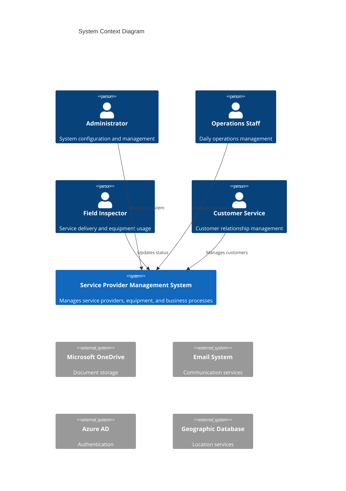

# Service Provider Management System

## Overview

The Service Provider Management System is an enterprise-grade web-based solution designed to streamline the management of service providers, equipment, and business processes. Built using Vue.js and Microsoft ASP.NET Core, this system provides a comprehensive platform for administrators, operations staff, field inspectors, and customer service representatives.

### Key Features
- Role-based access control with Azure AD B2C integration
- Customer profile and contract management
- Equipment tracking and assignment system
- Inspector mobilization and compliance tracking
- Document management with OneDrive integration
- Email notification system

## Architecture

### Technology Stack
- Frontend: Vue.js 3.x with Quasar Framework 2.x
- Backend: ASP.NET Core 6.0+ REST APIs
- Database: SQL Server 2019+ with Azure hosting
- Caching: Redis for session and data caching
- Storage: OneDrive for documents, Azure Storage for blobs
- Security: Azure AD B2C for authentication, JWT for API security

### High-Level Architecture


## Project Structure

```
├── src/
│   ├── web/                 # Frontend Vue.js application
│   ├── backend/            # ASP.NET Core services
│   └── shared/            # Shared types and utilities
├── infrastructure/
│   ├── azure/            # Azure ARM templates
│   └── docker/           # Docker configurations
├── tests/
│   ├── unit/            # Component and service tests
│   └── integration/     # API and E2E tests
└── docs/               # Additional documentation
```

## Setup Instructions

### Prerequisites
- Node.js 18+
- .NET 6.0 SDK
- Docker Desktop
- Azure CLI
- SQL Server Management Studio

### Development Setup

1. Clone the repository:
```bash
git clone https://github.com/organization/service-provider-management.git
cd service-provider-management
```

2. Configure environment:
```bash
cp .env.example .env
# Update .env with your settings
```

3. Initialize database:
```bash
dotnet ef database update
```

4. Start development servers:
```bash
# Frontend
cd src/web
npm install
npm run dev

# Backend
cd src/backend
dotnet run
```

### Deployment

1. Provision Azure resources:
```bash
az deployment group create --template-file infrastructure/azure/main.bicep
```

2. Deploy application:
```bash
az webapp deployment source config-zip --resource-group myResourceGroup --name myApp --src dist.zip
```

## Development Guidelines

### Coding Standards
- Frontend: Follow [Vue.js Style Guide](https://vuejs.org/style-guide/)
- Backend: Follow [C# Coding Conventions](https://docs.microsoft.com/en-us/dotnet/csharp/fundamentals/coding-style/coding-conventions)
- Testing: Maintain minimum 80% code coverage

### Git Workflow
- Branch naming: `feature/`, `bugfix/`, `hotfix/`
- Commit messages: Follow Conventional Commits format
- Pull requests: Require two approvals and passing CI checks

### CI/CD Pipeline
- Build: Azure DevOps pipelines
- Environments: Development, Staging, Production
- Deployment: Blue-green deployment strategy

## API Documentation

- OpenAPI specification available at `/swagger`
- Authentication: JWT tokens via Azure AD B2C
- Rate limiting: 1000 requests/minute per client
- API versioning: URL-based `/api/v1/`

## Security

### Authentication
- Azure AD B2C integration
- Multi-factor authentication support
- JWT token-based API security

### Authorization
- Role-based access control (RBAC)
- Fine-grained permission system
- Resource-level access control

### Data Protection
- TLS 1.3 for transport security
- AES-256 for data encryption
- SQL Always Encrypted for sensitive data

## Contributing

1. Fork the repository
2. Create feature branch (`git checkout -b feature/AmazingFeature`)
3. Commit changes (`git commit -m 'Add AmazingFeature'`)
4. Push to branch (`git push origin feature/AmazingFeature`)
5. Open pull request

### Code Review Process
- Two approvals required
- All tests must pass
- Code coverage requirements met
- Documentation updated

## License

Proprietary - All rights reserved

## Support

### Contact Information
- Technical Support: support@organization.com
- Emergency Contact: +1 (555) 123-4567

### Issue Reporting
1. Check existing issues
2. Use issue templates
3. Provide detailed reproduction steps
4. Include relevant logs and screenshots

### System Maintenance
- Scheduled maintenance: First Sunday of each month
- Emergency updates: As required with minimum 2-hour notice
- Status updates: status.organization.com

---

For detailed documentation, please visit the [Wiki](https://github.com/organization/service-provider-management/wiki)