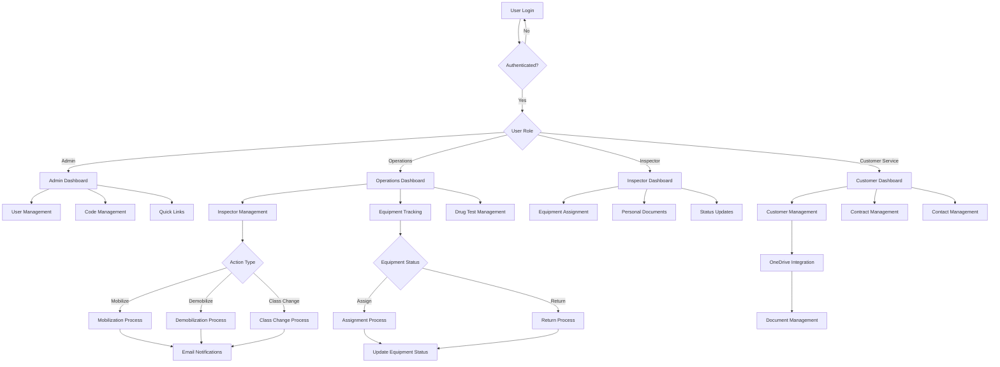
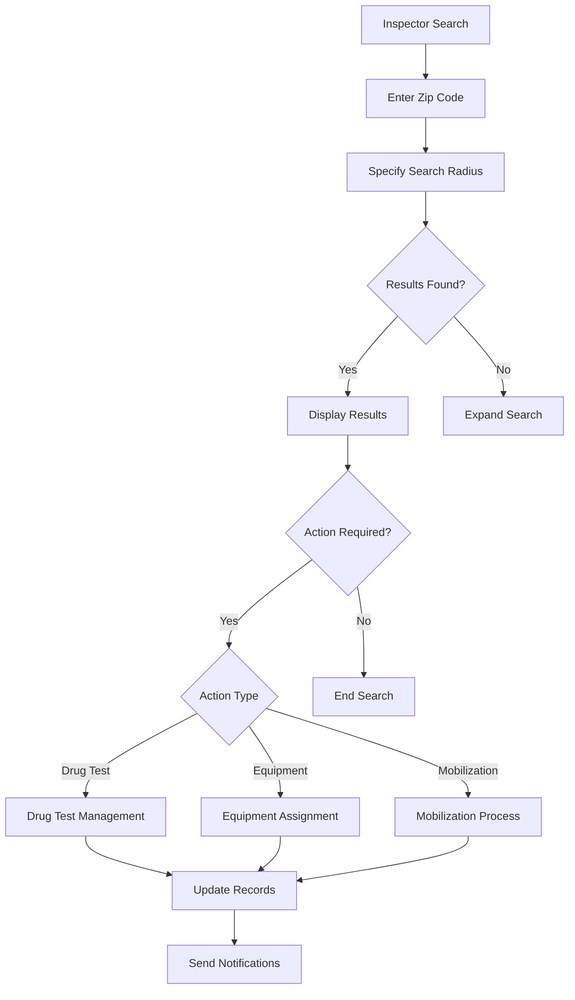
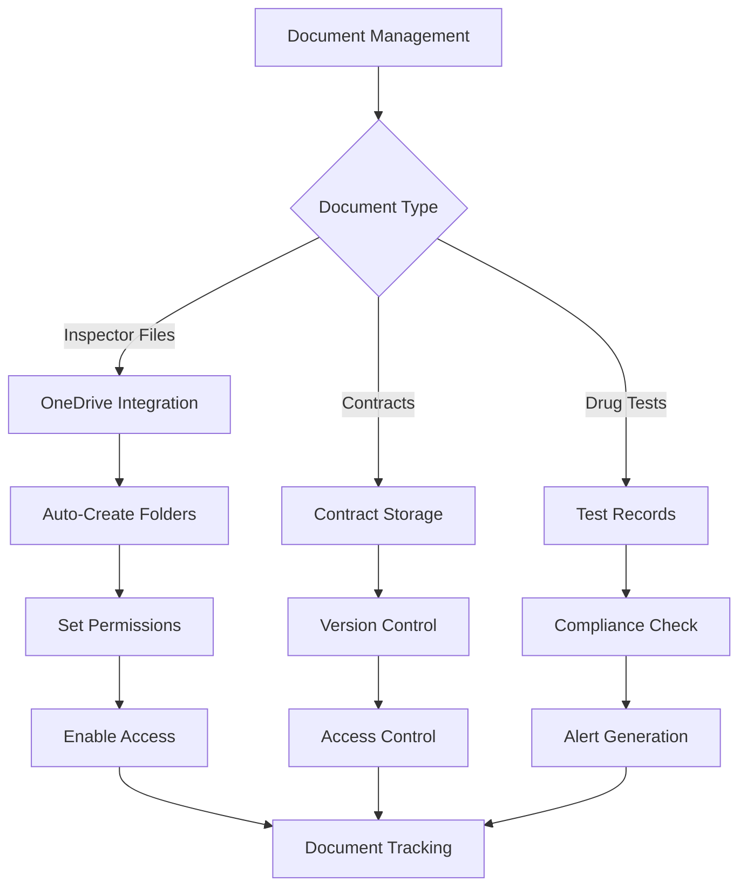
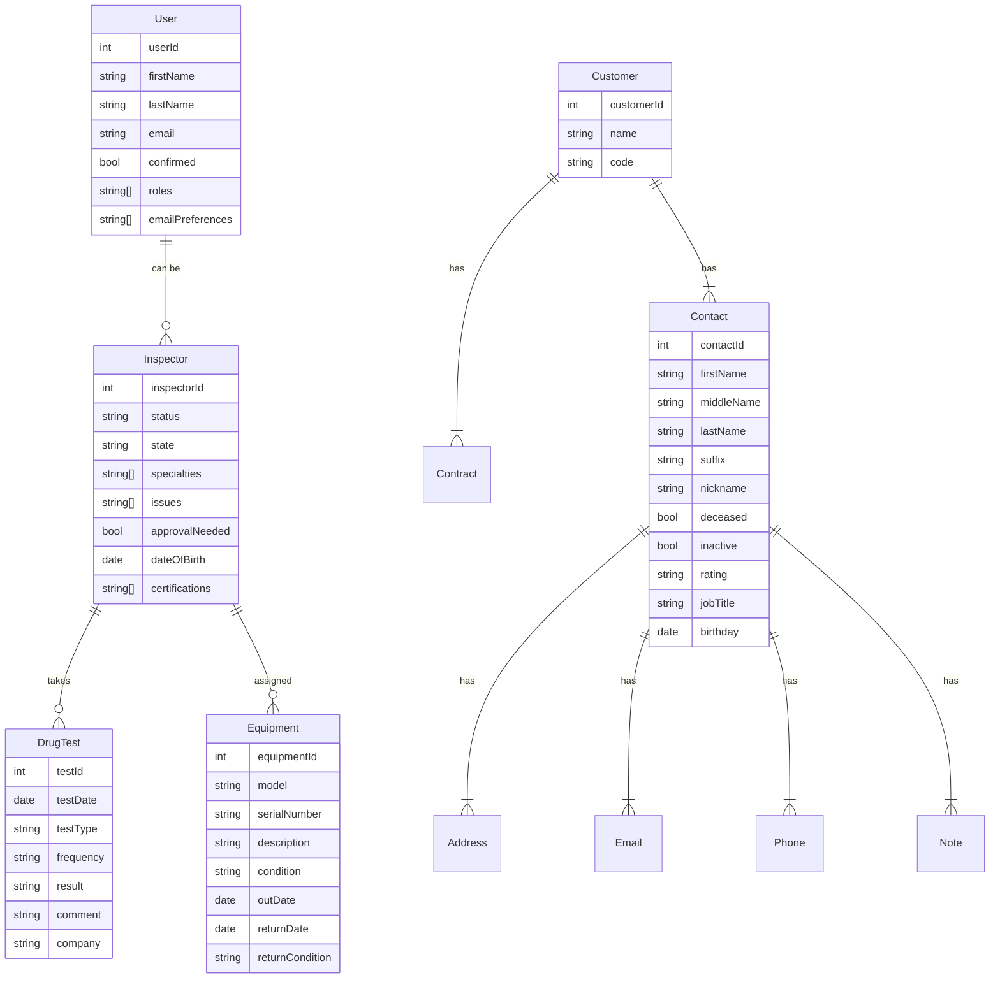
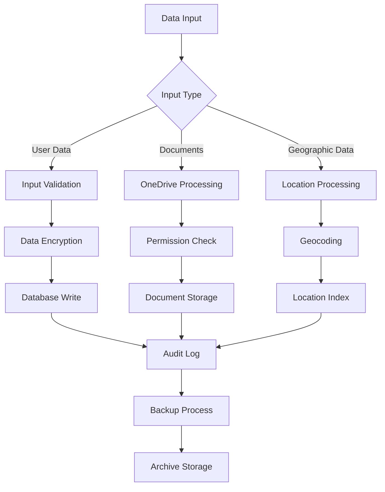

# Product Requirements Document (PRD)

# 1. INTRODUCTION

## 1.1 Purpose

This Software Requirements Specification (SRS) document provides a comprehensive description of the requirements for developing a web-based service provider management system. It serves as the primary reference for technical and non-technical stakeholders including developers, project managers, QA teams, and business stakeholders to ensure alignment on functionality, features, and implementation details.

## 1.2 Scope

The system will be a custom web application built using VueJS frontend and Microsoft ASP.NET Core backend technologies to manage service providers, their equipment, and related business processes. Key functionalities include:

- User management with role-based access control
- Customer relationship and contract management
- Equipment tracking and assignment
- Inspector management including mobilization/demobilization
- Drug test tracking and compliance
- Document management integration with OneDrive
- Email notifications and communications
- Geographical inspector search capabilities
- Code and configuration management

The system will provide a centralized platform to streamline operations, improve data accuracy, and enhance communication between all stakeholders while maintaining data security and access controls.

# 2. PRODUCT DESCRIPTION

## 2.1 Product Perspective
The service provider management system operates as a web-based enterprise application within the Client's existing technology infrastructure. It integrates with:
- Microsoft OneDrive for document storage and management
- Email systems for notifications and communications
- SQL geographical datasets for location-based searches
- Existing customer relationship management systems

The system follows a modern web architecture with:
- VueJS/Quasar Framework frontend for responsive user interface
- Microsoft ASP.NET Core backend for business logic and API services
- SQL Server database for data persistence
- Azure cloud hosting infrastructure

## 2.2 Product Functions
The system provides the following core functions:
- User and role-based access control management
- Customer and contract lifecycle management
- Equipment inventory and assignment tracking
- Inspector mobilization/demobilization workflow
- Drug testing compliance monitoring
- Geographical inspector search and matching
- Document management with OneDrive integration
- Email-based notifications and communications
- Code and configuration management
- Contact management with detailed tracking

## 2.3 User Characteristics
The system serves multiple user types:

1. Administrators
   - Technical expertise: High
   - Responsibilities: System configuration, user management, code maintenance
   - Access level: Full system access

2. Operations Staff
   - Technical expertise: Moderate
   - Responsibilities: Daily operations, inspector management, equipment tracking
   - Access level: Function-specific based on role

3. Field Inspectors
   - Technical expertise: Basic
   - Responsibilities: Equipment usage, status updates
   - Access level: Limited to personal information and assignments

4. Customer Service Representatives
   - Technical expertise: Moderate
   - Responsibilities: Customer relationship management, contract administration
   - Access level: Customer-related functions

## 2.4 Constraints
1. Technical Constraints
   - Must use VueJS for frontend development
   - Must use Microsoft ASP.NET Core for backend services
   - Must integrate with existing OneDrive infrastructure
   - Must support SQL Server database platform

2. Business Constraints
   - Must maintain role-based access control
   - Must comply with data privacy regulations
   - Must support existing business processes
   - Must integrate with current email systems

## 2.5 Assumptions and Dependencies
Assumptions:
- Users have access to modern web browsers
- Network connectivity is available for cloud services
- Basic technical proficiency of users
- Availability of required data from existing systems

Dependencies:
- Microsoft Azure cloud services availability
- OneDrive API accessibility
- SQL geographical dataset accuracy
- Email server functionality
- Third-party authentication services
- Database backup and recovery systems

# 3. PROCESS FLOWCHART

# 4. FUNCTIONAL REQUIREMENTS

## 4.1 User Management
**ID**: F001  
**Description**: System must provide comprehensive user management capabilities including creation, modification, and role assignment  
**Priority**: High  

| Requirement ID | Requirement Description | Validation Criteria |
|----------------|------------------------|-------------------|
| F001.1 | System shall support user creation with fields: First Name, Last Name, Email, Roles, Email Preferences | User can be created with all specified fields |
| F001.2 | System shall enforce email confirmation for new users | User receives confirmation email and must verify before access |
| F001.3 | System shall support role-based access control with predefined permission sets | Users can only access features within their role permissions |
| F001.4 | System shall allow administrators to modify user roles and permissions | Admin can update roles and permissions take effect immediately |
| F001.5 | System shall maintain audit logs of user management actions | All user management activities are logged with timestamp and actor |

## 4.2 Customer Management
**ID**: F002  
**Description**: System must provide customer relationship management functionality  
**Priority**: High  

| Requirement ID | Requirement Description | Validation Criteria |
|----------------|------------------------|-------------------|
| F002.1 | System shall support customer creation with fields: Name, Code, Contacts, Contracts | Customer records can be created with all required fields |
| F002.2 | System shall provide search functionality by name and code | Search returns accurate results based on input criteria |
| F002.3 | System shall support contract management for each customer | Contracts can be added, modified, and tracked per customer |
| F002.4 | System shall maintain detailed contact records with multiple address types | Contact information includes all specified fields and supports multiple addresses |
| F002.5 | System shall track customer interaction history and notes | All customer interactions are recorded with timestamp and user |

## 4.3 Equipment Management
**ID**: F003  
**Description**: System must track and manage equipment inventory and assignments  
**Priority**: Medium  

| Requirement ID | Requirement Description | Validation Criteria |
|----------------|------------------------|-------------------|
| F003.1 | System shall maintain equipment inventory with fields: Model, Serial Number, Description, Condition | Equipment can be added and tracked with all specified fields |
| F003.2 | System shall support equipment assignment to inspectors | Equipment can be assigned with out condition and date |
| F003.3 | System shall track equipment returns with condition assessment | Returns are recorded with in condition and date |
| F003.4 | System shall maintain equipment history by company | Equipment history is tracked and searchable by company |
| F003.5 | System shall generate alerts for overdue equipment | Alerts are triggered for equipment not returned on time |

## 4.4 Inspector Management
**ID**: F004  
**Description**: System must provide comprehensive inspector management capabilities  
**Priority**: High  

| Requirement ID | Requirement Description | Validation Criteria |
|----------------|------------------------|-------------------|
| F004.1 | System shall support geographical inspector search by zip code and radius | Search returns accurate results based on location criteria |
| F004.2 | System shall manage inspector mobilization process | Mobilization workflow includes all required fields and notifications |
| F004.3 | System shall track drug test results and compliance | Drug test records are maintained with all specified fields |
| F004.4 | System shall support inspector demobilization with reason tracking | Demobilization process captures all required information |
| F004.5 | System shall integrate with OneDrive for inspector documentation | Inspector files are automatically organized in OneDrive |

## 4.5 Document Management
**ID**: F005  
**Description**: System must provide document management capabilities integrated with OneDrive  
**Priority**: Medium  

| Requirement ID | Requirement Description | Validation Criteria |
|----------------|------------------------|-------------------|
| F005.1 | System shall auto-create folder structures in OneDrive | Folders are created automatically following defined hierarchy |
| F005.2 | System shall manage document permissions based on user roles | Document access is restricted based on user permissions |
| F005.3 | System shall support version control for contract documents | Document versions are tracked and maintained |
| F005.4 | System shall provide document search capabilities | Documents can be searched and retrieved efficiently |
| F005.5 | System shall track document access and modifications | Document activity is logged with user and timestamp |

## 4.6 Communication System
**ID**: F006  
**Description**: System must provide email notification and communication capabilities  
**Priority**: Medium  

| Requirement ID | Requirement Description | Validation Criteria |
|----------------|------------------------|-------------------|
| F006.1 | System shall support email template customization | Email templates can be created and modified |
| F006.2 | System shall send automated notifications for key events | Notifications are triggered automatically for specified events |
| F006.3 | System shall support attachment inclusion in emails | Files can be attached to emails within the system |
| F006.4 | System shall track email delivery and status | Email delivery status is monitored and recorded |
| F006.5 | System shall maintain communication history | All system communications are logged and searchable |

# 5. NON-FUNCTIONAL REQUIREMENTS

## 5.1 Performance Requirements

| Requirement | Description | Target Metric |
|-------------|-------------|---------------|
| Response Time | Maximum time for page loads and API responses | < 2 seconds at 95th percentile |
| Database Queries | Maximum execution time for complex queries | < 1 second |
| Concurrent Users | System must support simultaneous users | Minimum 100 concurrent users |
| API Throughput | Number of API requests handled | 1000 requests/minute |
| Resource Usage | Maximum server resource utilization | CPU < 80%, Memory < 85% |
| File Upload | Maximum time for document upload to OneDrive | < 5 seconds for files up to 10MB |

## 5.2 Safety Requirements

| Requirement | Description |
|-------------|-------------|
| Data Backup | Automated daily backups with 30-day retention |
| Failure Recovery | System must maintain data integrity during failures |
| Session Management | Automatic session timeout after 30 minutes of inactivity |
| Error Handling | Graceful error handling with user-friendly messages |
| Data Validation | Input validation on all forms before processing |
| Audit Trails | Comprehensive logging of all system modifications |

## 5.3 Security Requirements

| Requirement | Description |
|-------------|-------------|
| Authentication | Multi-factor authentication support for all users |
| Authorization | Role-based access control with granular permissions |
| Data Encryption | TLS 1.3 for data in transit, AES-256 for data at rest |
| Password Policy | Minimum 12 characters, complexity requirements, 90-day expiration |
| API Security | OAuth 2.0 implementation for API authentication |
| Audit Logging | Security event logging with tamper-evident storage |

## 5.4 Quality Requirements

### 5.4.1 Availability
- System uptime: 99.9% excluding planned maintenance
- Planned maintenance windows: Monthly, off-peak hours
- Maximum unplanned downtime: 4 hours per incident

### 5.4.2 Maintainability
- Modular architecture following SOLID principles
- Comprehensive API documentation
- Code coverage minimum 80%
- Automated deployment pipelines

### 5.4.3 Usability
- Mobile-responsive design for all screens
- WCAG 2.1 Level AA compliance
- Maximum 3 clicks to reach any function
- Consistent UI/UX across all modules

### 5.4.4 Scalability
- Horizontal scaling capability
- Support for 50% annual user growth
- Database partitioning support
- Microservices-ready architecture

### 5.4.5 Reliability
- Mean Time Between Failures (MTBF): > 720 hours
- Mean Time To Recovery (MTTR): < 2 hours
- Zero data loss during system failures
- Automated system health monitoring

## 5.5 Compliance Requirements

| Requirement | Description |
|-------------|-------------|
| Data Privacy | GDPR and CCPA compliance for personal data handling |
| Industry Standards | ISO 27001 security controls implementation |
| Accessibility | Section 508 compliance for federal contracts |
| Documentation | Maintenance of technical and user documentation |
| Audit Support | Support for external security audits |
| Data Retention | Configurable retention policies per data type |

# 6. DATA REQUIREMENTS

## 6.1 Data Models

## 6.2 Data Storage

### 6.2.1 Database Configuration
- Primary storage: SQL Server hosted on Azure
- Database partitioning by customer for scalability
- Separate schemas for core entities: Users, Customers, Equipment, Inspectors
- Indexed views for frequently accessed data

### 6.2.2 Document Storage
- OneDrive integration for document management
- Hierarchical folder structure: Customer > Year > Document Type
- Automatic folder creation and permission inheritance
- Version control enabled for contract documents

### 6.2.3 Data Retention
- Active records: Indefinite retention
- Archived customer data: 7 years
- Drug test records: 5 years
- Equipment history: 3 years
- System logs: 1 year rolling retention
- Audit trails: 3 years

### 6.2.4 Backup and Recovery
- Full database backup: Daily
- Differential backups: Every 6 hours
- Transaction log backups: Every 15 minutes
- Point-in-time recovery capability: 30 days
- Geo-redundant backup storage
- Maximum recovery time objective (RTO): 4 hours
- Recovery point objective (RPO): 15 minutes

## 6.3 Data Processing

### 6.3.1 Data Security
- Data encryption at rest using AES-256
- TLS 1.3 encryption for data in transit
- Column-level encryption for PII
- Row-level security for customer data
- Encrypted backup files
- Key rotation every 90 days

### 6.3.2 Data Validation
- Server-side validation for all inputs
- Data type enforcement
- Business rule validation
- Referential integrity checks
- Input sanitization
- Format validation for specialized fields

### 6.3.3 Data Integration
- Real-time synchronization with OneDrive
- Batch processing for geographic data updates
- Event-driven updates for equipment status
- Queued processing for email notifications
- API-based integration with external systems

# 7. EXTERNAL INTERFACES

## 7.1 User Interfaces

### 7.1.1 General Requirements
- Responsive web interface built with VueJS and Quasar Framework
- Support for modern web browsers (Chrome, Firefox, Safari, Edge)
- Mobile-first design approach with breakpoints at 320px, 768px, 1024px, 1440px
- WCAG 2.1 Level AA compliance for accessibility

### 7.1.2 Layout Structure
- Persistent top navigation bar with user context and quick actions
- Left sidebar for main navigation (collapsible on mobile)
- Content area with breadcrumb navigation
- Modal dialogs for forms and confirmations
- Toast notifications for system messages

### 7.1.3 Common Components
- Data tables with virtual scrolling
- Form inputs with validation feedback
- Search interfaces with type-ahead functionality
- File upload components with drag-and-drop support
- Date pickers with timezone awareness
- Multi-select dropdowns for code/configuration selection

## 7.2 Hardware Interfaces

### 7.2.1 Client Devices
- Minimum screen resolution: 320x480 pixels
- Supported input devices: Touch screens, mouse, keyboard
- Required hardware capabilities: Camera access for document scanning
- Minimum memory: 4GB RAM for optimal performance

## 7.3 Software Interfaces

### 7.3.1 Microsoft OneDrive Integration
- Protocol: REST API
- Authentication: OAuth 2.0
- Operations: Create/Read/Update/Delete files and folders
- File size limits: Maximum 10MB per upload
- Folder structure enforcement

### 7.3.2 Email System Integration
- Protocol: SMTP
- Authentication: TLS/SSL
- Template support: HTML email templates
- Attachment handling: Up to 25MB total size
- Delivery tracking capabilities

### 7.3.3 SQL Server Database
- Connection: Entity Framework Core
- Version compatibility: SQL Server 2019+
- Transaction management: ACID compliance
- Backup integration: Azure Backup service
- Geographic data support: SQL Spatial types

### 7.3.4 Azure Services
- Identity management: Azure AD B2C
- Storage: Azure Blob Storage
- Monitoring: Application Insights
- Caching: Azure Redis Cache
- Search: Azure Cognitive Search

## 7.4 Communication Interfaces

### 7.4.1 API Protocols
- RESTful API endpoints using HTTPS
- JSON data format for request/response
- API versioning through URL prefixing
- Rate limiting: 1000 requests per minute
- Compression: gzip for responses

### 7.4.2 Authentication Protocols
- JWT token-based authentication
- Token expiration: 1 hour
- Refresh token validity: 24 hours
- MFA integration via Azure AD
- API key authentication for service accounts

### 7.4.3 Data Exchange Formats
- JSON for API data
- CSV for bulk data exports
- XML for legacy system integration
- UTF-8 encoding requirement
- ISO 8601 date/time format

### 7.4.4 Network Requirements
- HTTPS (TLS 1.3) for all communications
- WebSocket support for real-time updates
- Port requirements: 443 (HTTPS), 465 (SMTP)
- IPv6 compatibility
- VPN support for administrative access

# 8. APPENDICES

## 8.1 GLOSSARY

| Term | Definition |
|------|------------|
| Mobilization | Process of activating an inspector for a new project or assignment |
| Demobilization | Process of deactivating an inspector from their current assignment |
| Class Change | Process of modifying an inspector's classification level or specialization |
| Drug Test Kit | Physical testing equipment used for conducting drug screening |
| ISP Trans | Inspector Service Provider Transaction |
| D/A Pool | Drug and Alcohol Testing Pool |
| Ship Opt | Shipping Option for equipment delivery |
| Hire Pack | Collection of onboarding documents for new hires |
| Virtual Scrolling | Technique for efficiently rendering large lists by only loading visible items |

## 8.2 ACRONYMS

| Acronym | Expansion |
|---------|-----------|
| API | Application Programming Interface |
| CRUD | Create, Read, Update, Delete |
| DOB | Date of Birth |
| JWT | JSON Web Token |
| MFA | Multi-Factor Authentication |
| PII | Personally Identifiable Information |
| REST | Representational State Transfer |
| SRS | Software Requirements Specification |
| TLS | Transport Layer Security |
| WCAG | Web Content Accessibility Guidelines |

## 8.3 ADDITIONAL REFERENCES

| Reference | Description | URL |
|-----------|-------------|-----|
| Vue.js Documentation | Official documentation for Vue.js framework | https://vuejs.org/guide/ |
| Quasar Framework | UI component library documentation | https://quasar.dev/docs |
| ASP.NET Core Documentation | Microsoft's official documentation for backend framework | https://docs.microsoft.com/aspnet/core |
| Azure AD B2C | Authentication service documentation | https://docs.microsoft.com/azure/active-directory-b2c/ |
| OneDrive API Reference | Microsoft Graph API documentation for OneDrive integration | https://docs.microsoft.com/graph/api/resources/onedrive |
| Entity Framework Core | Data access documentation | https://docs.microsoft.com/ef/core/ |