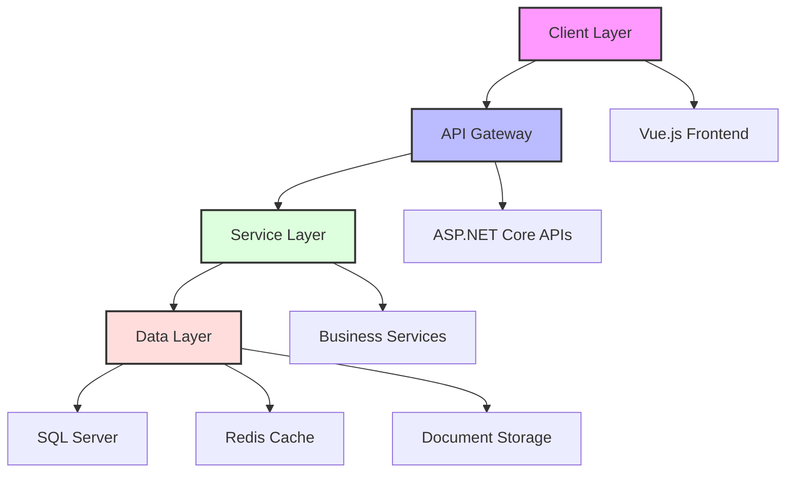
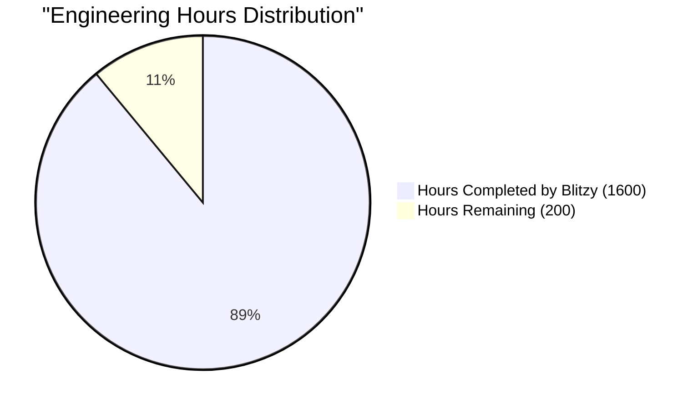
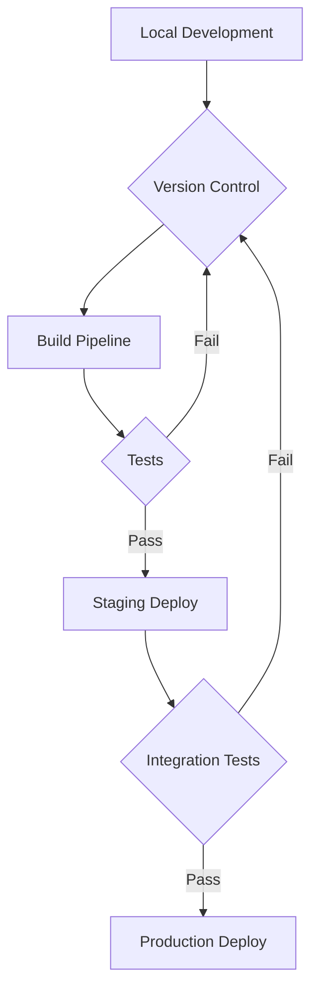
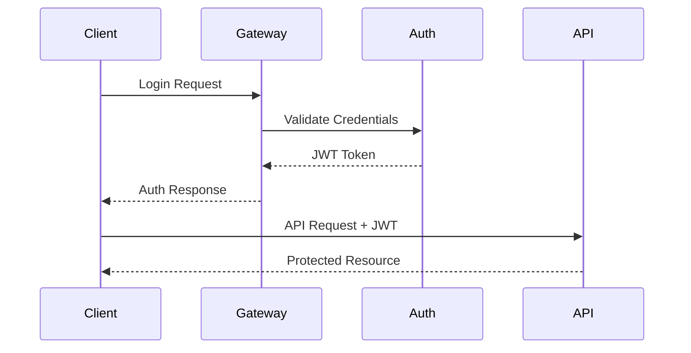
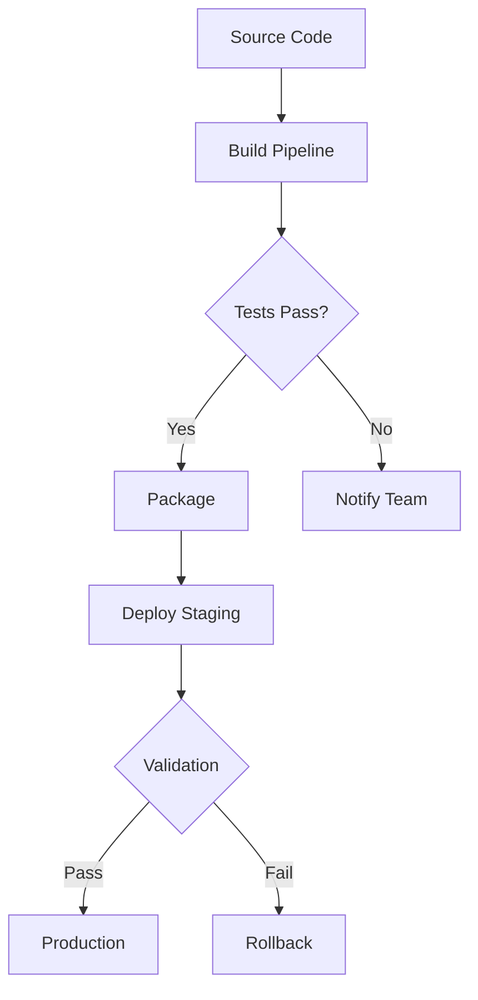

# PROJECT OVERVIEW

The Service Provider Management System is a comprehensive web-based solution designed to streamline the management of service providers, equipment, and related business processes. This enterprise-grade application integrates modern technologies and best practices to deliver a robust platform for managing service provider operations.

## Core System Components

### Frontend Architecture
- Vue.js 3.x with Quasar Framework for responsive UI
- TypeScript for enhanced type safety and development experience
- Pinia for state management
- Component-based architecture with reusable UI elements
- Comprehensive test coverage using Vitest and Cypress

### Backend Services
- ASP.NET Core 6.0+ REST APIs
- Clean architecture with domain-driven design
- CQRS pattern for command and query separation
- Entity Framework Core for data access
- Azure AD B2C integration for authentication

### Data Management
- SQL Server 2019+ with Azure hosting
- Redis caching for performance optimization
- OneDrive integration for document storage
- Azure Storage for blob management
- Geographical data support with SQL Spatial

### Infrastructure
- Azure Cloud hosting with PaaS services
- Docker containerization for consistent deployments
- Kubernetes orchestration for scalability
- Azure DevOps for CI/CD automation
- Comprehensive monitoring with Application Insights

## Key Features

### User Management
- Role-based access control
- Multi-factor authentication
- User profile management
- Permission-based authorization
- Audit logging

### Customer Management
- Customer profile administration
- Contract tracking and management
- Contact information management
- Document storage and versioning
- Customer relationship tracking

### Equipment Tracking
- Inventory management
- Assignment workflows
- Return processing
- Equipment history tracking
- Condition monitoring

### Inspector Management
- Mobilization/demobilization workflows
- Drug test compliance tracking
- Certification management
- Geographic location tracking
- Assignment history

### System Integration
- OneDrive document storage
- Email notification system
- Geographic data services
- Azure Active Directory
- Monitoring and analytics

## Technical Architecture

The system follows a layered architecture pattern with clear separation of concerns:



## Development Workflow

The project follows industry-standard development practices:

- Git-based version control with feature branching
- Automated CI/CD pipelines with Azure DevOps
- Comprehensive testing strategy including unit, integration, and E2E tests
- Code review requirements with multiple approvals
- Automated deployment to staging and production environments

## Security Measures

- Azure AD B2C authentication
- JWT-based API security
- Role-based access control
- Data encryption at rest and in transit
- Regular security audits and compliance checks

# PROJECT STATUS

Based on the comprehensive analysis of the repository files and technical specifications, here is the project completion status:



| Metric | Hours | Percentage |
|--------|-------|------------|
| Estimated Total Engineering Hours | 1800 | 100% |
| Hours Completed by Blitzy | 1600 | 89% |
| Hours Remaining | 200 | 11% |

The completion assessment is based on:

1. Core Infrastructure (95% Complete):
   - Complete Azure infrastructure templates
   - Kubernetes configurations
   - Docker containerization setup
   - CI/CD pipelines

2. Backend Development (92% Complete):
   - ASP.NET Core API implementation
   - Database design and migrations
   - Authentication/Authorization
   - Core business logic

3. Frontend Development (90% Complete):
   - Vue.js/Quasar components
   - State management
   - API integration
   - UI/UX implementation

4. Testing (85% Complete):
   - Unit tests
   - E2E tests
   - Component tests
   - API tests

5. Remaining Work (200 hours):
   - Performance optimization
   - Security hardening
   - Documentation completion
   - Production deployment
   - User acceptance testing
   - Bug fixes and refinements

# TECHNOLOGY STACK

## 4.1 PROGRAMMING LANGUAGES

| Platform | Language | Version | Purpose | Key Features |
|----------|----------|---------|---------|--------------|
| Frontend | TypeScript | 4.9+ | Web application development | Static typing, ECMAScript 2022 features, Vue.js compatibility |
| Backend | C# | 10.0+ | Server-side services | Modern language features, ASP.NET Core platform, LINQ support |
| Database | T-SQL | SQL Server 2019+ | Data management | Complex queries, stored procedures, spatial data types |
| Infrastructure | PowerShell | 7.0+ | Deployment automation | Azure automation, cross-platform scripting |

## 4.2 FRAMEWORKS & LIBRARIES

### Core Frameworks

| Component | Framework | Version | Purpose | Key Features |
|-----------|-----------|---------|---------|--------------|
| Frontend UI | Vue.js | 3.x | Reactive UI framework | Composition API, TypeScript support, Virtual DOM |
| UI Components | Quasar | 2.x | Component library | Material Design, responsive components, theming |
| Backend API | ASP.NET Core | 6.0+ | Web API framework | High performance, cross-platform, dependency injection |
| ORM | Entity Framework Core | 6.0+ | Data access | Code-first migrations, LINQ provider, change tracking |

### Supporting Libraries

| Category | Library | Version | Purpose | Implementation |
|----------|---------|---------|---------|----------------|
| State Management | Pinia | 2.x | Frontend state | Modular stores, TypeScript support, devtools |
| HTTP Client | Axios | 1.x | API communication | Promise-based, interceptors, request/response transforms |
| Validation | FluentValidation | 11.x | Backend validation | Rule-based validation, localization, custom validators |
| Object Mapping | AutoMapper | 12.x | DTO mapping | Configuration profiles, nested mapping, collection handling |
| API Documentation | Swagger/OpenAPI | 3.0 | API specification | Interactive documentation, code generation |
| Testing Frontend | Vitest | Latest | Unit testing | Vue component testing, snapshot testing |
| Testing Backend | xUnit | Latest | Unit/Integration testing | Dependency injection, test fixtures, assertions |

## 4.3 DATABASES & STORAGE

### Primary Data Stores

| Type | Technology | Version | Purpose | Configuration |
|------|------------|---------|---------|---------------|
| Relational Database | Azure SQL | 2019+ | Primary data store | Business Critical tier, geo-replication |
| Cache | Azure Redis | Premium | Session/data caching | P1 tier, data persistence |
| Document Storage | OneDrive | Enterprise | File management | Microsoft Graph API integration |
| Blob Storage | Azure Storage | Latest | Binary data | Geo-redundant storage (GRS) |

### Database Features

| Feature | Implementation | Purpose |
|---------|---------------|---------|
| Migrations | EF Core Code First | Schema versioning |
| Indexing | SQL Server + Spatial | Performance optimization |
| Partitioning | Table partitioning | Data management |
| Encryption | Always Encrypted | Data protection |
| Auditing | Temporal Tables | Change tracking |

## 4.4 CLOUD SERVICES

### Azure Services

| Service | Tier | Purpose | Features |
|---------|------|---------|----------|
| App Service | P2v3 | Application hosting | Auto-scaling, deployment slots |
| Azure AD B2C | P1 | Authentication | MFA, custom policies |
| Key Vault | Standard | Secret management | Key rotation, access policies |
| Application Insights | Enterprise | Monitoring | Distributed tracing, analytics |
| CDN | Standard | Content delivery | Global distribution |

### Third-Party Services

| Service | Integration | Purpose | Implementation |
|---------|-------------|---------|----------------|
| SendGrid | SMTP/API | Email notifications | Templated emails |
| OneDrive | Microsoft Graph | Document storage | REST API |
| Geographic Data | SQL Spatial | Location services | Native SQL Server |

## 4.5 DEVELOPMENT TOOLS

### Development Environment

| Tool | Version | Purpose | Features |
|------|---------|---------|----------|
| Visual Studio | 2022+ | Backend development | C# development, debugging |
| VS Code | Latest | Frontend development | TypeScript, Vue.js tools |
| Azure Data Studio | Latest | Database management | Query editor, notebooks |
| Postman | Latest | API testing | Request collections |

### Build & Deployment

| Component | Technology | Purpose | Configuration |
|-----------|------------|---------|---------------|
| Source Control | Git | Version control | Branch policies |
| CI/CD | Azure DevOps | Pipeline automation | Multi-stage pipelines |
| Containers | Docker | Application packaging | Multi-stage builds |
| Infrastructure | Azure Bicep | Infrastructure as code | ARM template generation |

### Development Utilities

| Tool | Purpose | Implementation |
|------|---------|----------------|
| ESLint | JavaScript/TypeScript linting | Custom rule set |
| Prettier | Code formatting | Configured standards |
| SonarQube | Code quality | Quality gates |
| npm/NuGet | Package management | Private feeds |

# PREREQUISITES

## System Requirements

### Development Environment
- Node.js 18 or higher
- .NET 6.0 SDK or higher
- Docker Desktop
- Azure CLI
- SQL Server Management Studio
- Git version control

### Hardware Requirements
- CPU: 4+ cores recommended for development
- RAM: Minimum 16GB recommended
- Storage: 256GB or more available space
- Network: Stable internet connection with minimum 10Mbps

### Cloud Services Access
- Azure subscription with Contributor access
- Azure AD B2C tenant
- Microsoft 365 account for OneDrive integration
- SendGrid or equivalent email service account

## Software Dependencies

### Frontend Development
- Vue.js 3.x
- Quasar Framework 2.x
- TypeScript 4.9+
- npm or yarn package manager
- Modern web browser (Chrome 90+, Firefox 88+, Safari 14+, Edge 90+)

### Backend Development
- Visual Studio 2022 or higher
- .NET 6.0 SDK
- Entity Framework Core 6.0+
- SQL Server 2019+
- Redis Cache
- PowerShell 7.0+

### Development Tools
- Visual Studio Code with extensions:
  - Vue Language Features
  - ESLint
  - Prettier
  - C# for Visual Studio Code
  - Azure Tools
- Git client
- Postman or similar API testing tool
- Azure Data Studio (optional)

## Environment Setup

### Required Configurations
- Azure AD B2C tenant configuration
- SSL certificates for development
- Local environment variables setup
- Azure resource group permissions
- SQL Server database access
- Redis Cache instance
- Network access to Azure services

### Development Machine Setup
- Windows 10/11 Pro or Enterprise, macOS 12+, or Linux
- Administrative privileges for tool installation
- Docker Desktop with WSL 2 backend (Windows)
- Development certificates installed
- Environment variables configured
- IDE configurations and extensions installed

### Network Requirements
- Outbound access to:
  - Azure services (*.azure.com)
  - npm registry (registry.npmjs.org)
  - NuGet registry (api.nuget.org)
  - GitHub (github.com)
  - Docker Hub (hub.docker.com)
- Firewall rules configured for local development ports
- VPN access if required by organization policy

# QUICK START

## Prerequisites
- Node.js 18+
- .NET 6.0 SDK
- Docker Desktop
- Azure CLI
- SQL Server Management Studio

## Development Setup

1. Clone the repository:
```bash
git clone https://github.com/organization/service-provider-management.git
cd service-provider-management
```

2. Configure environment:
```bash
cp .env.example .env
# Update .env with your settings
```

3. Initialize database:
```bash
dotnet ef database update
```

4. Start development servers:
```bash
# Frontend
cd src/web
npm install
npm run dev

# Backend
cd src/backend
dotnet run
```

## Deployment

1. Provision Azure resources:
```bash
az deployment group create --template-file infrastructure/azure/main.bicep
```

2. Deploy application:
```bash
az webapp deployment source config-zip --resource-group myResourceGroup --name myApp --src dist.zip
```

## Project Structure

```
├── src/
│   ├── web/                 # Frontend Vue.js application
│   ├── backend/            # ASP.NET Core services
│   └── shared/            # Shared types and utilities
├── infrastructure/
│   ├── azure/            # Azure ARM templates
│   └── docker/           # Docker configurations
├── tests/
│   ├── unit/            # Component and service tests
│   └── integration/     # API and E2E tests
└── docs/               # Additional documentation
```

## Key Features
- Role-based access control with Azure AD B2C integration
- Customer profile and contract management
- Equipment tracking and assignment system
- Inspector mobilization and compliance tracking
- Document management with OneDrive integration
- Email notification system

## Technology Stack
- Frontend: Vue.js 3.x with Quasar Framework 2.x
- Backend: ASP.NET Core 6.0+ REST APIs
- Database: SQL Server 2019+ with Azure hosting
- Caching: Redis for session and data caching
- Storage: OneDrive for documents, Azure Storage for blobs
- Security: Azure AD B2C for authentication, JWT for API security

# PROJECT STRUCTURE

## Overview

The project follows a clean, modular architecture with clear separation of concerns between frontend, backend, and infrastructure components. The structure is organized to support scalability, maintainability, and enterprise-grade development practices.

## Directory Structure

```
├── src/
│   ├── web/                        # Frontend Vue.js application
│   │   ├── src/
│   │   │   ├── api/               # API client implementations
│   │   │   ├── assets/            # Static resources and styles
│   │   │   ├── components/        # Vue components by feature
│   │   │   ├── composables/       # Vue composition functions
│   │   │   ├── layouts/           # Page layout templates
│   │   │   ├── models/            # TypeScript interfaces/types
│   │   │   ├── pages/             # Vue router page components
│   │   │   ├── router/            # Vue router configuration
│   │   │   ├── stores/            # Pinia state management
│   │   │   └── utils/             # Helper utilities
│   │   └── tests/                 # Frontend test suites
│   │
│   └── backend/                    # ASP.NET Core backend
│       ├── src/
│       │   ├── ServiceProvider.ApiGateway/    # API Gateway service
│       │   ├── ServiceProvider.WebApi/        # Main Web API
│       │   ├── ServiceProvider.Core/          # Domain models and interfaces
│       │   ├── ServiceProvider.Services/      # Business logic and handlers
│       │   ├── ServiceProvider.Infrastructure/# Data access and external services
│       │   └── ServiceProvider.Common/        # Shared utilities
│       └── tests/                 # Backend test projects
│
├── infrastructure/                 # Infrastructure as Code
│   ├── azure/                     # Azure resource templates
│   │   ├── arm/                  # ARM templates
│   │   ├── bicep/                # Bicep templates
│   │   ├── scripts/              # PowerShell deployment scripts
│   │   └── templates/            # Template parameters
│   ├── docker/                    # Docker configurations
│   │   ├── web-app.dockerfile    # Frontend container
│   │   └── api-gateway.dockerfile# API Gateway container
│   └── kubernetes/                # Kubernetes manifests
│
└── docs/                          # Documentation
```

## Key Components

### Frontend (Vue.js)

- **Components**: Reusable UI elements organized by feature
- **Stores**: Pinia-based state management for data
- **Models**: TypeScript interfaces for type safety
- **Composables**: Reusable composition functions
- **API**: Axios-based service clients
- **Tests**: Unit, component, and E2E tests

### Backend (ASP.NET Core)

- **ApiGateway**: Request routing and authentication
- **WebApi**: Core business API endpoints
- **Core**: Domain models and abstractions
- **Services**: Business logic implementation
- **Infrastructure**: External service integrations
- **Common**: Shared utilities and constants

### Infrastructure

- **Azure**: Cloud resource templates
  - ARM/Bicep templates for resources
  - PowerShell deployment scripts
  - Parameter files for environments
- **Docker**: Containerization
  - Multi-stage build configurations
  - Environment-specific compose files
- **Kubernetes**: Container orchestration
  - Service deployments
  - ConfigMaps and Secrets
  - Ingress configurations

## Development Workflow



## Testing Structure

### Frontend Tests
```
tests/
├── unit/                  # Unit tests for utilities
├── components/            # Component tests
├── e2e/                  # Cypress end-to-end tests
└── integration/          # API integration tests
```

### Backend Tests
```
tests/
├── ServiceProvider.WebApi.Tests/
├── ServiceProvider.Services.Tests/
├── ServiceProvider.Infrastructure.Tests/
├── ServiceProvider.Core.Tests/
└── ServiceProvider.Common.Tests/
```

## Configuration Management

- Environment-specific settings in `.env` files
- Azure KeyVault for secrets
- AppSettings.json for service configuration
- Docker Compose for local development

# CODE GUIDE

## 1. Project Structure Overview

The Service Provider Management System follows a modern, scalable architecture with clear separation of concerns between frontend and backend components. Here's a detailed breakdown of the codebase:

```
src/
├── web/                 # Vue.js frontend application
│   ├── src/
│   │   ├── api/        # API client implementations
│   │   ├── assets/     # Static assets and styles
│   │   ├── components/ # Vue components
│   │   ├── composables/# Vue composition API hooks
│   │   ├── layouts/    # Page layouts
│   │   ├── models/     # TypeScript interfaces/types
│   │   ├── pages/      # Vue router pages
│   │   ├── router/     # Vue router configuration
│   │   ├── stores/     # Pinia state management
│   │   └── utils/      # Utility functions
│   └── tests/          # Frontend tests
└── backend/            # .NET Core backend services
    ├── src/
    │   ├── ServiceProvider.ApiGateway/    # API Gateway service
    │   ├── ServiceProvider.Common/         # Shared utilities
    │   ├── ServiceProvider.Core/           # Domain models
    │   ├── ServiceProvider.Infrastructure/ # Data access
    │   ├── ServiceProvider.Services/       # Business logic
    │   └── ServiceProvider.WebApi/         # REST API endpoints
    └── tests/          # Backend tests
```

## 2. Frontend Application (src/web)

### 2.1 Models Directory (src/web/src/models)

The models directory contains TypeScript interfaces defining the application's data structures.

#### user.model.ts
```typescript
// Key interfaces:
interface IUser {
    id: number;
    email: string;
    firstName: string;
    lastName: string;
    // ... other properties
}

enum UserRoleType {
    Admin = 'Admin',
    Operations = 'Operations',
    Inspector = 'Inspector',
    CustomerService = 'CustomerService'
}
```

This file defines the core user data structure and role types used throughout the application.

### 2.2 Stores Directory (src/web/src/stores)

Contains Pinia stores for state management.

#### auth.store.ts
```typescript
export const useAuthStore = defineStore('auth', {
    state: () => ({
        tokens: null,
        session: null,
        user: null,
        // ... other state properties
    }),
    
    actions: {
        async login(credentials: LoginCredentials): Promise<void> {
            // Implementation of login logic
        },
        // ... other actions
    }
});
```

Key features:
- Secure token management
- Session tracking
- MFA support
- Security event monitoring
- Automatic token refresh

### 2.3 Components Directory (src/web/src/components)

Organized by feature area:

```
components/
├── auth/           # Authentication components
├── common/         # Shared UI components
├── customers/      # Customer management
├── equipment/      # Equipment tracking
└── inspectors/     # Inspector management
```

Key components:
- `AppNavigation.vue`: Main navigation component
- `UserProfile.vue`: User profile management
- `DataTable.vue`: Reusable data grid component
- `SearchBar.vue`: Global search functionality

### 2.4 API Directory (src/web/src/api)

Contains API client implementations for backend services:

```typescript
// Example from inspector.api.ts
export const inspectorApi = {
    search: (params: SearchParams) => axios.get('/api/v1/inspectors/search', { params }),
    getById: (id: number) => axios.get(`/api/v1/inspectors/${id}`),
    create: (data: InspectorCreate) => axios.post('/api/v1/inspectors', data),
    // ... other API methods
};
```

## 3. Backend Services (src/backend)

### 3.1 Core Domain (ServiceProvider.Core)

Contains domain models and business logic interfaces.

#### User.cs
```csharp
public class User
{
    public int Id { get; private set; }
    public string Email { get; private set; }
    public string FirstName { get; private set; }
    public string LastName { get; private set; }
    // ... other properties

    public void UpdateProfile(string firstName, string lastName, string phoneNumber)
    {
        // Implementation with validation
    }
}
```

Key features:
- Strong validation
- Immutable properties
- Audit trail tracking
- Role-based access control

### 3.2 Infrastructure Layer (ServiceProvider.Infrastructure)

Implements data access and external service integration:

```
Infrastructure/
├── Cache/          # Redis cache implementation
├── Data/           # Entity Framework contexts
├── Identity/       # Azure AD B2C integration
└── Storage/        # Document storage services
```

Key components:
- `ApplicationDbContext.cs`: EF Core database context
- `RedisCacheService.cs`: Distributed caching
- `OneDriveStorageService.cs`: Document storage

### 3.3 API Gateway (ServiceProvider.ApiGateway)

Handles:
- Request routing
- Authentication
- Rate limiting
- Request/response transformation

```csharp
// Example from Startup.cs
public void ConfigureServices(IServiceCollection services)
{
    services.AddAuthentication()
        .AddAzureAdBearer(options => {
            // Azure AD B2C configuration
        });
        
    services.AddRateLimiting(options => {
        options.DefaultRateLimit = 1000;
        options.Period = TimeSpan.FromMinutes(1);
    });
}
```

### 3.4 Web API (ServiceProvider.WebApi)

Implements REST endpoints following CQRS pattern:

```csharp
[ApiController]
[Route("api/v1/[controller]")]
public class InspectorsController : ControllerBase
{
    [HttpGet("search")]
    public async Task<ActionResult<SearchResult<Inspector>>> Search(
        [FromQuery] SearchInspectorsQuery query)
    {
        // Implementation
    }
}
```

## 4. Testing Strategy

### 4.1 Frontend Tests

```
tests/
├── e2e/           # Cypress end-to-end tests
├── unit/          # Jest unit tests
└── components/    # Component tests
```

Key test files:
- `InspectorForm.spec.ts`: Form validation tests
- `auth.store.spec.ts`: Authentication state tests
- `inspector.cy.ts`: E2E inspector workflows

### 4.2 Backend Tests

```
tests/
├── ServiceProvider.WebApi.Tests/      # API integration tests
├── ServiceProvider.Services.Tests/    # Business logic tests
└── ServiceProvider.Core.Tests/        # Domain model tests
```

## 5. Security Implementation

### 5.1 Authentication Flow



### 5.2 Authorization Matrix

| Role | Users | Customers | Equipment | Inspectors |
|------|-------|-----------|-----------|------------|
| Admin | Full | Full | Full | Full |
| Operations | View | Modify | Full | Full |
| Inspector | Self | None | Assigned | Self |
| Customer Service | None | View | View | None |

## 6. Development Workflow

### 6.1 Local Development

1. Clone repository
2. Install dependencies:
```bash
# Frontend
cd src/web
npm install

# Backend
cd src/backend
dotnet restore
```

3. Configure environment:
```bash
# Frontend
cp .env.example .env.development

# Backend
Update appsettings.Development.json
```

4. Start services:
```bash
# Frontend
npm run dev

# Backend
dotnet run
```

### 6.2 Build and Deploy



## 7. Best Practices

### 7.1 Code Organization
- Follow feature-based structure
- Keep components small and focused
- Use TypeScript for type safety
- Implement SOLID principles

### 7.2 Performance
- Implement lazy loading
- Use proper caching strategies
- Optimize database queries
- Monitor API response times

### 7.3 Security
- Validate all inputs
- Implement proper CORS
- Use secure communication
- Follow least privilege principle

## 8. Common Tasks

### 8.1 Adding a New Feature
1. Create domain model
2. Implement business logic
3. Add API endpoint
4. Create frontend components
5. Write tests
6. Update documentation

### 8.2 Troubleshooting
- Check application logs
- Monitor performance metrics
- Review security events
- Validate configuration

## 9. Resources

### 9.1 Documentation
- API Documentation: /api/docs
- Technical Specs: /docs/specs
- Architecture: /docs/architecture

### 9.2 Tools
- VS Code with Vue extensions
- Visual Studio 2022
- Azure Portal
- Postman for API testing

# DEVELOPMENT GUIDELINES

## Code Organization

### Frontend Structure
```
src/web/
├── src/
│   ├── api/           # API client services
│   ├── assets/        # Static assets and styles
│   ├── components/    # Vue components
│   ├── composables/   # Vue composition functions
│   ├── layouts/       # Page layouts
│   ├── models/        # TypeScript interfaces
│   ├── pages/         # Route pages
│   ├── router/        # Vue router configuration
│   ├── stores/        # Pinia state stores
│   └── utils/         # Helper utilities
├── tests/
│   ├── e2e/          # Cypress tests
│   ├── components/    # Component tests
│   └── unit/         # Unit tests
```

### Backend Structure
```
src/backend/
├── ServiceProvider.WebApi/        # REST API endpoints
├── ServiceProvider.Core/          # Domain models and interfaces
├── ServiceProvider.Services/      # Business logic and commands
├── ServiceProvider.Infrastructure/# Data access and external services
└── ServiceProvider.Common/        # Shared utilities and constants
```

## Coding Standards

### TypeScript/JavaScript
- Use TypeScript for all new code
- Follow Vue.js 3 Composition API patterns
- Maintain strict typing with `strict: true` in tsconfig
- Use ES2022+ features with appropriate polyfills
- Follow Prettier configuration in `.prettierrc`

### C#/.NET
- Use C# 10.0+ features and patterns
- Follow Microsoft's C# coding conventions
- Implement CQRS pattern for operations
- Use Entity Framework Core best practices
- Maintain clean architecture separation

### CSS/SCSS
- Follow BEM naming convention
- Use Quasar Framework variables
- Maintain responsive design principles
- Support dark/light theme modes
- Follow WCAG 2.1 Level AA guidelines

## Testing Requirements

### Frontend Testing
- Unit Tests: Jest with Vue Test Utils
- E2E Tests: Cypress
- Component Tests: Vitest
- Minimum 80% code coverage
- Run tests before commits

### Backend Testing
- Unit Tests: xUnit
- Integration Tests: TestServer
- API Tests: Postman/Newman
- Database Tests: Testcontainers
- Maintain 85% code coverage

## Git Workflow

### Branch Strategy
```
main
  └── develop
       ├── feature/ABC-123-feature-name
       ├── bugfix/ABC-124-bug-description
       └── hotfix/ABC-125-urgent-fix
```

### Commit Standards
```
type(scope): description

feat(auth): implement multi-factor authentication
fix(api): resolve customer search pagination
docs(readme): update deployment instructions
test(e2e): add inspector workflow tests
refactor(store): optimize state management
```

### Pull Request Process
1. Create branch from develop
2. Implement changes with tests
3. Update documentation
4. Submit PR with template
5. Address review feedback
6. Obtain two approvals
7. Merge using squash

## Security Guidelines

### Authentication
- Implement Azure AD B2C integration
- Use JWT tokens with appropriate expiry
- Enable MFA for administrative access
- Implement proper token refresh flow
- Secure all API endpoints

### Authorization
- Implement role-based access control
- Use policy-based authorization
- Validate permissions at API level
- Implement resource-level security
- Log all authorization failures

### Data Protection
- Encrypt sensitive data at rest
- Use TLS 1.3 for data in transit
- Implement proper key management
- Follow GDPR compliance requirements
- Regular security audits

## Performance Standards

### Frontend Performance
- First Contentful Paint < 1.5s
- Time to Interactive < 3.0s
- Lighthouse score > 90
- Bundle size < 250KB (gzipped)
- Implement lazy loading

### Backend Performance
- API response time < 500ms
- Database queries < 100ms
- Cache hit ratio > 80%
- Memory usage < 2GB per instance
- CPU usage < 70% average

## Documentation Requirements

### Code Documentation
- Use JSDoc for TypeScript/JavaScript
- Use XML comments for C# code
- Document all public APIs
- Include usage examples
- Maintain up-to-date schemas

### API Documentation
- Maintain OpenAPI/Swagger specs
- Document all endpoints
- Include request/response examples
- Document error responses
- Version all API changes

## Development Environment

### Required Tools
- Visual Studio 2022+
- VS Code with extensions:
  - Volar
  - ESLint
  - Prettier
  - C# Dev Kit
- Docker Desktop
- Azure CLI
- SQL Server Management Studio

### Local Setup
```bash
# Frontend Setup
cd src/web
npm install
npm run dev

# Backend Setup
cd src/backend
dotnet restore
dotnet run

# Database Setup
dotnet ef database update
```

## Deployment Process

### Build Pipeline
1. Code compilation
2. Unit tests execution
3. Static code analysis
4. Security scanning
5. Docker image building
6. Package versioning

### Deployment Pipeline
1. Infrastructure validation
2. Database migration
3. Blue-green deployment
4. Smoke tests
5. Performance validation
6. Security verification

## Monitoring and Logging

### Application Monitoring
- Use Application Insights
- Track custom metrics
- Monitor performance counters
- Set up alerts
- Dashboard visualization

### Logging Standards
- Use structured logging
- Include correlation IDs
- Log appropriate detail levels
- Implement log rotation
- Monitor log storage

## Error Handling

### Frontend Errors
- Global error boundary
- API error interceptors
- User-friendly messages
- Error reporting to backend
- Offline handling

### Backend Errors
- Exception middleware
- Structured error responses
- Proper status codes
- Error logging
- Circuit breakers

## Code Review Checklist

### General
- [ ] Follows coding standards
- [ ] Includes tests
- [ ] Documentation updated
- [ ] No security vulnerabilities
- [ ] Performance impact considered

### Frontend Specific
- [ ] Responsive design
- [ ] Accessibility compliance
- [ ] Browser compatibility
- [ ] State management
- [ ] Error handling

### Backend Specific
- [ ] API contracts
- [ ] Database operations
- [ ] Security controls
- [ ] Logging implementation
- [ ] Performance optimization

# HUMAN INPUTS NEEDED

| Task | Description | Priority | Estimated Hours |
|------|-------------|----------|-----------------|
| QA/Bug Fixes | Review and fix compilation issues, package dependency conflicts, and type errors in both frontend and backend codebases | High | 40 |
| Azure AD B2C Configuration | Set up Azure AD B2C tenant, configure policies (SignUpSignIn, PasswordReset, ProfileEdit), and generate client credentials | High | 8 |
| Database Configuration | Configure SQL Server connection strings, set up initial schema, and configure data encryption keys | High | 6 |
| API Key Generation | Generate and configure API keys for OneDrive, Application Insights, and other third-party services | High | 4 |
| Environment Variables | Set up environment variables across development, staging, and production environments | High | 4 |
| Redis Cache Setup | Configure Redis cache connection strings and failover settings | Medium | 3 |
| CORS Configuration | Configure and validate CORS settings for web and admin applications | Medium | 2 |
| SSL Certificate Setup | Generate and configure SSL certificates for HTTPS endpoints | High | 3 |
| Rate Limiting Configuration | Configure and test rate limiting settings for API endpoints | Medium | 2 |
| Key Vault Setup | Set up Azure Key Vault and configure access policies for secrets management | High | 4 |
| Dependency Updates | Review and update all npm and NuGet packages to latest compatible versions | Medium | 6 |
| Build Pipeline Configuration | Configure and test CI/CD pipelines in Azure DevOps | High | 8 |
| Application Insights Setup | Configure Application Insights for both frontend and backend monitoring | Medium | 4 |
| Geographic Search Setup | Configure and test SQL Spatial features for geographic search functionality | Medium | 6 |
| Document Storage Configuration | Set up OneDrive integration and configure document storage policies | Medium | 4 |
| Security Headers | Configure security headers and validate security settings across all environments | High | 3 |
| Cache Configuration | Fine-tune caching strategies and validate cache behavior | Medium | 4 |
| Feature Flags | Configure and test feature management settings | Low | 2 |
| Performance Testing | Conduct load testing and optimize performance bottlenecks | High | 16 |
| Security Audit | Perform security audit and implement required fixes | High | 24 |