# Technical Specifications

# 1. INTRODUCTION

## 1.1 EXECUTIVE SUMMARY

The Service Provider Management System is a comprehensive web-based solution designed to streamline the management of service providers, equipment, and related business processes. Built using VueJS and Microsoft ASP.NET Core, the system addresses critical operational challenges in tracking inspector qualifications, equipment assignments, and customer relationships. The solution will serve administrators, operations staff, field inspectors, and customer service representatives through a unified platform that enhances data accuracy, improves communication, and ensures compliance with business requirements.

The system will replace manual tracking processes and disparate systems, providing centralized management of inspector mobilization, equipment tracking, drug testing compliance, and customer contract administration. This consolidation is expected to reduce administrative overhead, improve data accuracy, and enhance operational efficiency across the organization.

## 1.2 SYSTEM OVERVIEW

### Project Context

| Aspect | Description |
|--------|-------------|
| Business Context | Centralized platform for managing service provider operations and compliance |
| Current Limitations | Manual processes, fragmented systems, limited visibility into provider status |
| Enterprise Integration | Interfaces with OneDrive, email systems, and SQL geographical datasets |

### High-Level Description

| Component | Implementation |
|-----------|----------------|
| Frontend Architecture | VueJS with Quasar Framework for responsive interface |
| Backend Services | Microsoft ASP.NET Core REST APIs |
| Data Storage | SQL Server with Azure hosting |
| Document Management | OneDrive integration for file storage |
| Authentication | Role-based access control with Azure AD |

### Success Criteria

| Criteria | Target Metric |
|----------|---------------|
| User Adoption | 90% of target users actively using system within 3 months |
| Data Accuracy | 99% reduction in data entry errors |
| Process Efficiency | 50% reduction in administrative processing time |
| System Performance | 99.9% uptime during business hours |

## 1.3 SCOPE

### In-Scope Features

| Category | Components |
|----------|------------|
| User Management | - Role-based access control<br>- User authentication and authorization<br>- Permission management |
| Customer Management | - Customer profile administration<br>- Contract tracking<br>- Contact management |
| Equipment Tracking | - Inventory management<br>- Assignment tracking<br>- Return processing |
| Inspector Management | - Mobilization/demobilization workflows<br>- Drug test tracking<br>- Geographic search capabilities |
| Document Management | - OneDrive integration<br>- Automated folder creation<br>- Document version control |
| Communication | - Email notifications<br>- Template management<br>- Communication history |

### Implementation Boundaries

| Boundary Type | Coverage |
|---------------|----------|
| System Access | Web-based interface accessible via modern browsers |
| User Groups | Administrators, Operations Staff, Inspectors, Customer Service |
| Geographic Coverage | North American operations |
| Data Domains | Customer, Equipment, Inspector, and Contract data |

### Out-of-Scope Elements

- Mobile native applications
- Offline operation capabilities
- Third-party marketplace integration
- Financial transaction processing
- Legacy system data migration
- Custom reporting engine
- Real-time video conferencing
- Hardware procurement
- User training program development
- Disaster recovery implementation

# 2. SYSTEM ARCHITECTURE

## 2.1 High-Level Architecture

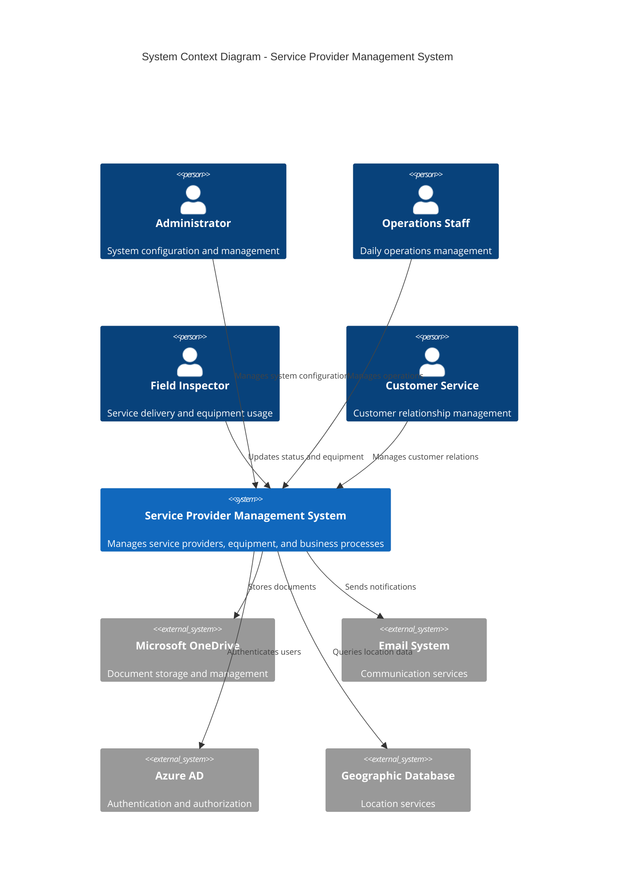

```mermaid
C4Container
    title Container Diagram - Service Provider Management System

    Container(web_app, "Web Application", "Vue.js + Quasar", "Provides user interface")
    Container(api_gateway, "API Gateway", "ASP.NET Core", "Routes and authenticates requests")
    
    Container_Boundary(services, "Core Services") {
        Container(user_svc, "User Service", "ASP.NET Core", "User management")
        Container(customer_svc, "Customer Service", "ASP.NET Core", "Customer management")
        Container(equipment_svc, "Equipment Service", "ASP.NET Core", "Equipment tracking")
        Container(inspector_svc, "Inspector Service", "ASP.NET Core", "Inspector management")
        Container(doc_svc, "Document Service", "ASP.NET Core", "Document handling")
    }

    ContainerDb(sql_db, "SQL Database", "SQL Server", "Primary data store")
    ContainerDb(redis, "Cache", "Redis", "Session and data caching")

    Rel(web_app, api_gateway, "Uses", "HTTPS/REST")
    Rel(api_gateway, user_svc, "Routes", "HTTPS/REST")
    Rel(api_gateway, customer_svc, "Routes", "HTTPS/REST")
    Rel(api_gateway, equipment_svc, "Routes", "HTTPS/REST")
    Rel(api_gateway, inspector_svc, "Routes", "HTTPS/REST")
    Rel(api_gateway, doc_svc, "Routes", "HTTPS/REST")

    Rel(user_svc, sql_db, "Reads/Writes")
    Rel(customer_svc, sql_db, "Reads/Writes")
    Rel(equipment_svc, sql_db, "Reads/Writes")
    Rel(inspector_svc, sql_db, "Reads/Writes")
    Rel(doc_svc, sql_db, "Reads/Writes")

    Rel_Back(services, redis, "Caches data")
```

## 2.2 Component Details

### Core Components

| Component | Purpose | Technologies | Key Interfaces | Data Storage | Scaling Strategy |
|-----------|---------|--------------|----------------|--------------|------------------|
| Web Frontend | User interface | Vue.js, Quasar | REST API Client | Browser Storage | Horizontal scaling with CDN |
| API Gateway | Request routing | ASP.NET Core | REST APIs | Redis Cache | Load balancer distribution |
| User Service | Identity management | ASP.NET Core | /api/users/* | SQL Server | Horizontal scaling |
| Customer Service | Customer management | ASP.NET Core | /api/customers/* | SQL Server | Horizontal scaling |
| Equipment Service | Equipment tracking | ASP.NET Core | /api/equipment/* | SQL Server | Horizontal scaling |
| Inspector Service | Inspector management | ASP.NET Core | /api/inspectors/* | SQL Server | Horizontal scaling |
| Document Service | File management | ASP.NET Core | /api/documents/* | SQL Server + OneDrive | Horizontal scaling |

## 2.3 Technical Decisions

### Architecture Patterns

| Pattern | Implementation | Justification |
|---------|---------------|---------------|
| Layered Architecture | Presentation, Business, Data Access layers | Clear separation of concerns |
| API Gateway | Centralized routing and authentication | Security and request management |
| Repository Pattern | Data access abstraction | Database independence |
| CQRS | Separate read/write operations | Performance optimization |
| Event-Driven | Message queues for async operations | System decoupling |

### Data Architecture

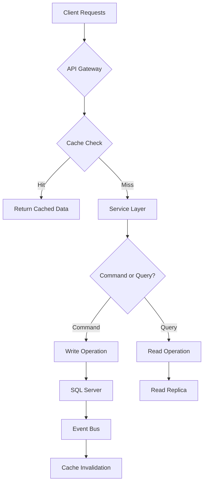

## 2.4 Cross-Cutting Concerns

### Monitoring and Security

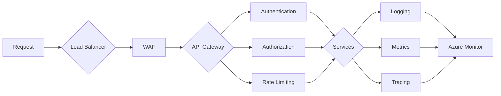

### Deployment Architecture

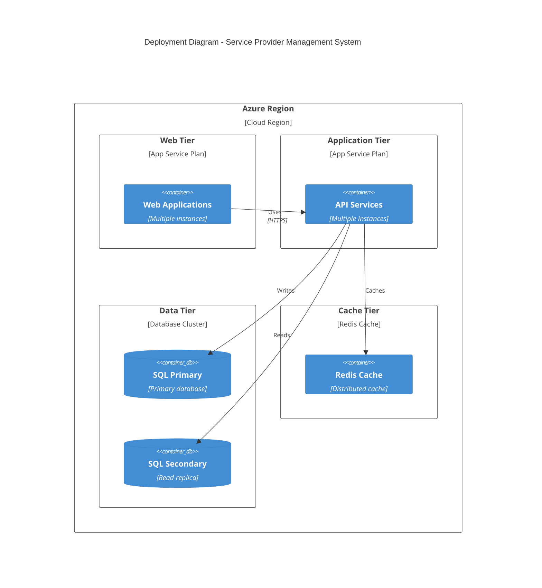

## 2.5 Performance and Scalability

| Component | Performance Target | Scaling Mechanism | Monitoring Metrics |
|-----------|-------------------|-------------------|-------------------|
| Web Frontend | < 2s page load | Auto-scaling based on CPU | Response time, Error rate |
| API Services | < 500ms response | Horizontal pod scaling | Request rate, CPU usage |
| Database | < 100ms query time | Read replicas | Query performance, Connections |
| Cache | < 10ms access time | Memory scaling | Hit rate, Memory usage |
| Document Storage | < 5s upload time | Storage capacity scaling | IO operations, Latency |

# 3. SYSTEM COMPONENTS ARCHITECTURE

## 3.1 USER INTERFACE DESIGN

### Design Specifications

| Aspect | Requirement |
|--------|-------------|
| Visual Hierarchy | Material Design principles with custom Quasar components |
| Component Library | Quasar Framework v2.0+ with custom theme extensions |
| Responsive Breakpoints | xs: 320px, sm: 768px, md: 1024px, lg: 1440px, xl: 1920px |
| Accessibility | WCAG 2.1 Level AA compliance |
| Browser Support | Chrome 90+, Firefox 88+, Safari 14+, Edge 90+ |
| Theme Support | Light/Dark modes with system preference detection |
| Internationalization | English (US) primary, component-level i18n support |

### Interface Elements

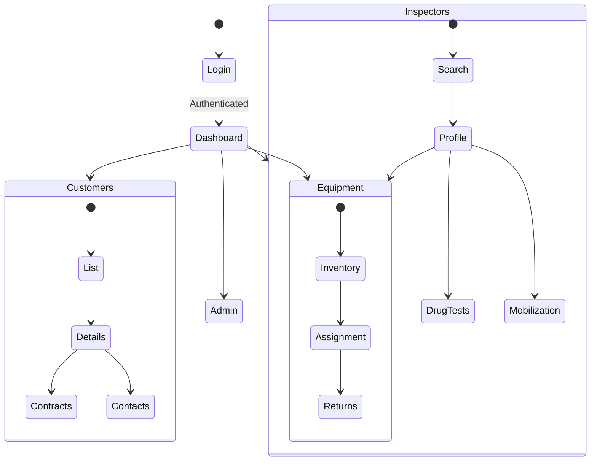

### Critical User Flows

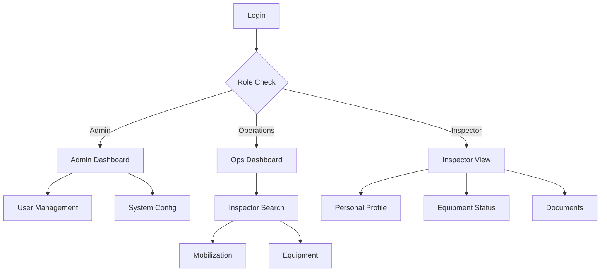

## 3.2 DATABASE DESIGN

### Schema Design

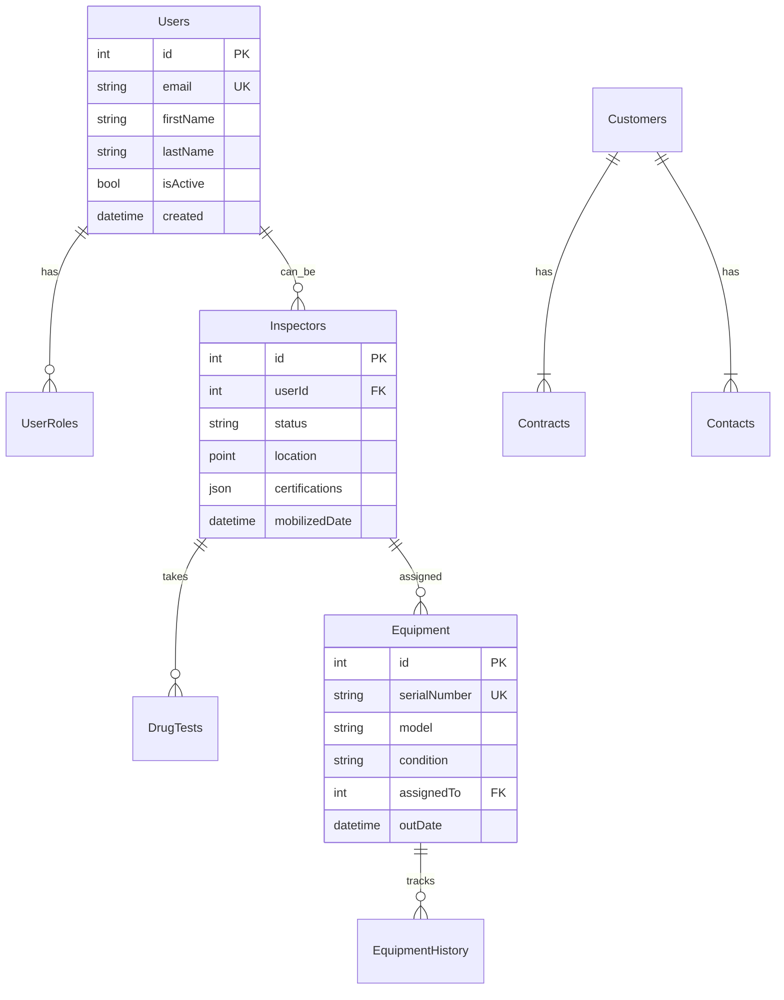

### Data Management Strategy

| Aspect | Implementation |
|--------|---------------|
| Migrations | Entity Framework Core code-first migrations |
| Versioning | Sequential migration numbering with descriptions |
| Archival | Yearly partitioning with sliding window retention |
| Retention | Active data: Indefinite, Archived: 7 years |
| Privacy | Column-level encryption for PII |
| Audit | Temporal tables for change tracking |

## 3.3 API DESIGN

### API Architecture

| Component | Specification |
|-----------|--------------|
| Protocol | REST over HTTPS |
| Authentication | JWT with Azure AD B2C |
| Authorization | Role-based with claim validation |
| Rate Limiting | 1000 requests/minute per client |
| Versioning | URL-based (/api/v1/) |
| Documentation | OpenAPI 3.0 with Swagger UI |

### Interface Specifications

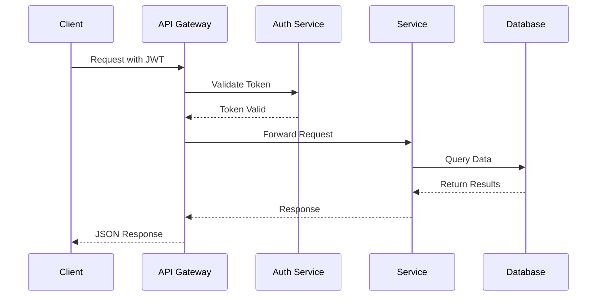

### Integration Requirements

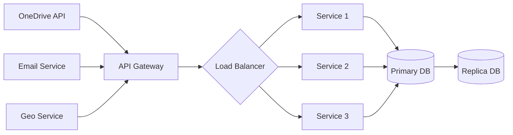

# 4. TECHNOLOGY STACK

## 4.1 PROGRAMMING LANGUAGES

| Platform | Language | Version | Justification |
|----------|----------|---------|---------------|
| Frontend | JavaScript/TypeScript | ES2022/TS 4.9+ | Type safety, modern features, Vue.js compatibility |
| Backend | C# | 10.0+ | ASP.NET Core platform requirement, enterprise support |
| Database | T-SQL | SQL Server 2019+ | Complex data queries, stored procedures |
| Scripting | PowerShell | 7.0+ | Azure automation, deployment scripts |

## 4.2 FRAMEWORKS & LIBRARIES

### Core Frameworks

| Component | Framework | Version | Justification |
|-----------|-----------|---------|---------------|
| Frontend UI | Vue.js | 3.x | Reactive UI, component-based architecture |
| UI Components | Quasar | 2.x | Material Design, enterprise components |
| Backend API | ASP.NET Core | 6.0+ | Enterprise support, performance, scalability |
| ORM | Entity Framework Core | 6.0+ | Data access abstraction, LINQ support |

### Supporting Libraries

| Purpose | Library | Version | Usage |
|---------|---------|---------|--------|
| State Management | Pinia | 2.x | Vue.js state management |
| API Client | Axios | 1.x | HTTP client for API calls |
| Validation | FluentValidation | 11.x | Backend request validation |
| Mapping | AutoMapper | 12.x | Object-object mapping |
| Documentation | Swagger/OpenAPI | 3.0 | API documentation |

## 4.3 DATABASES & STORAGE

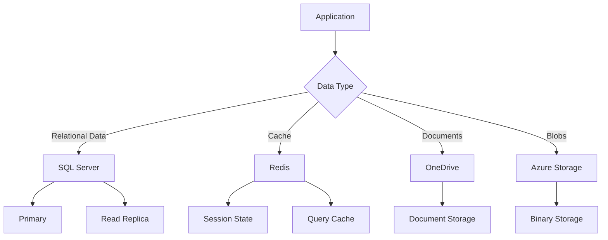

| Component | Technology | Purpose | Configuration |
|-----------|------------|---------|---------------|
| Primary Database | SQL Server 2019 | Relational data | Azure SQL Managed Instance |
| Cache | Redis | Session/data cache | Azure Cache for Redis |
| Document Storage | OneDrive | File management | Microsoft Graph API |
| Blob Storage | Azure Storage | Large binary data | Geo-redundant storage |

## 4.4 THIRD-PARTY SERVICES

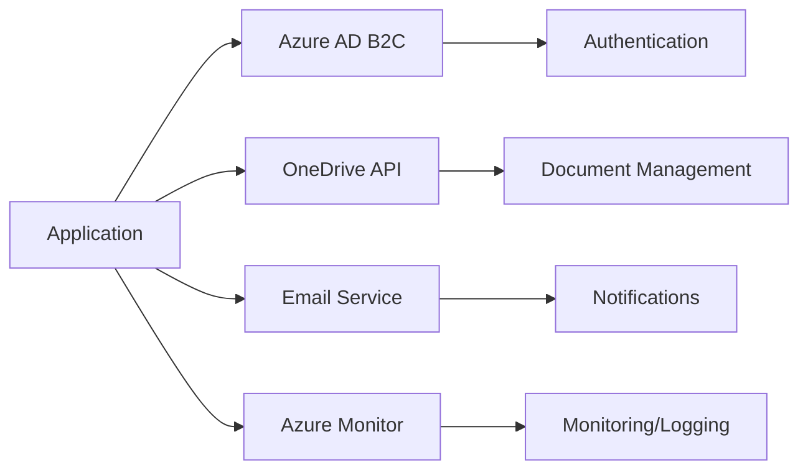

| Service | Provider | Purpose | Integration Method |
|---------|----------|---------|-------------------|
| Authentication | Azure AD B2C | Identity management | OAuth 2.0/OpenID Connect |
| Document Storage | Microsoft Graph | File management | REST API |
| Email | SendGrid | Notifications | SMTP/API |
| Monitoring | Application Insights | Telemetry | SDK Integration |
| Geographic Data | SQL Spatial | Location services | Native SQL Server |

## 4.5 DEVELOPMENT & DEPLOYMENT

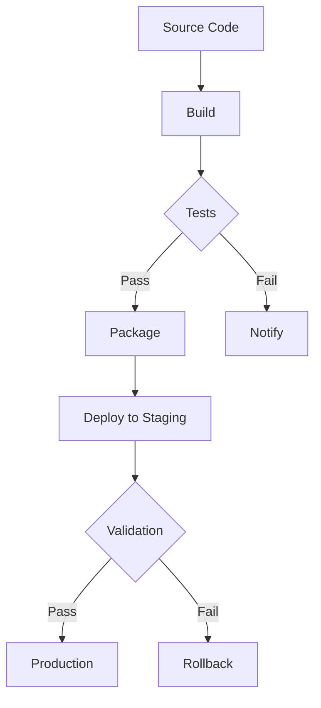

### Development Tools

| Category | Tool | Version | Purpose |
|----------|------|---------|---------|
| IDE | Visual Studio | 2022+ | Backend development |
| IDE | VS Code | Latest | Frontend development |
| Version Control | Git | 2.x+ | Source control |
| Package Management | npm | 8.x+ | Frontend dependencies |
| Package Management | NuGet | 6.x+ | Backend dependencies |

### Build & Deployment

| Component | Technology | Configuration |
|-----------|------------|---------------|
| Build System | Azure DevOps | Multi-stage pipelines |
| Containerization | Azure App Service | Managed PaaS |
| Infrastructure | Azure ARM | Infrastructure as code |
| Monitoring | Azure Monitor | Application insights |

### Environment Requirements

| Environment | Purpose | Configuration |
|-------------|---------|---------------|
| Development | Local development | Docker containers |
| Testing | Integration testing | Azure Test Plans |
| Staging | Pre-production | Production mirror |
| Production | Live system | High availability |

# 5. SYSTEM DESIGN

## 5.1 USER INTERFACE DESIGN

### Layout Structure

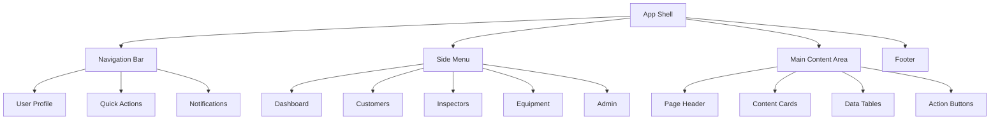

### Component Hierarchy

| Component Level | Elements | Responsibility |
|----------------|----------|----------------|
| Shell Components | Navigation, Menu, Content Area | Layout structure and routing |
| Smart Components | Data Tables, Forms, Search | Business logic and data handling |
| Base Components | Buttons, Inputs, Cards | Reusable UI elements |
| Dialog Components | Modals, Alerts, Confirmations | User interactions |

### Page Templates

| Template | Layout | Primary Components |
|----------|--------|-------------------|
| List View | Two-column with filters | Search bar, Data table, Action buttons |
| Detail View | Tabbed card layout | Info cards, Related data tables, Edit forms |
| Dashboard | Grid layout | Summary cards, Charts, Quick actions |
| Admin | Split view | Configuration tree, Settings forms |

## 5.2 DATABASE DESIGN

### Schema Overview


### Table Specifications

| Table | Primary Key | Foreign Keys | Indexes | Partitioning |
|-------|-------------|--------------|---------|--------------|
| Users | Id (Identity) | None | Email, LastName | None |
| Inspectors | Id (Identity) | UserId | Location, Status | By Status |
| Equipment | Id (Identity) | AssignedTo | SerialNumber | By Year |
| DrugTests | Id (Identity) | InspectorId | TestDate | By Year |
| Customers | Id (Identity) | None | Code, Name | By Region |
| Contracts | Id (Identity) | CustomerId | StartDate | By Customer |

## 5.3 API DESIGN

### API Architecture


### Endpoint Specifications

| Resource | Method | Endpoint | Request Body | Response |
|----------|--------|----------|--------------|----------|
| Users | GET | /api/v1/users | None | User[] |
| Users | POST | /api/v1/users | UserCreate | User |
| Inspectors | GET | /api/v1/inspectors/search | SearchParams | Inspector[] |
| Equipment | PUT | /api/v1/equipment/{id}/assign | AssignmentDetails | Equipment |
| DrugTests | POST | /api/v1/drugtests | TestDetails | DrugTest |

### Authentication Flow

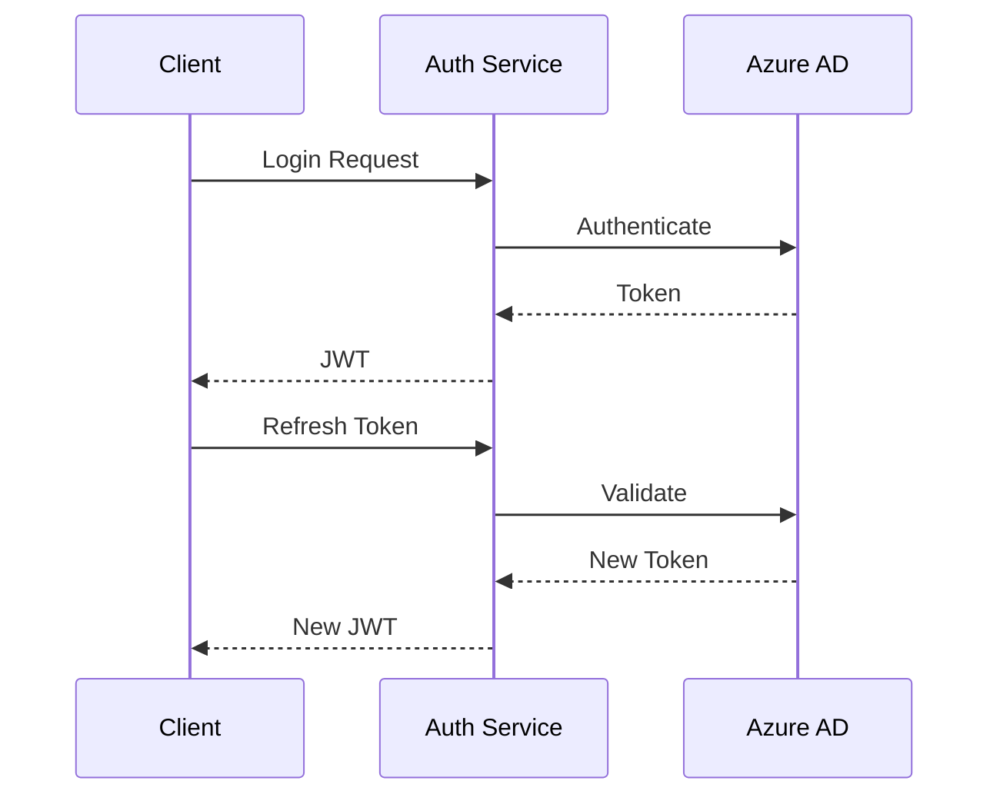

### API Security

| Security Layer | Implementation | Purpose |
|----------------|----------------|----------|
| Authentication | JWT with Azure AD | Identity verification |
| Authorization | Role-based claims | Access control |
| Rate Limiting | Per-client throttling | Abuse prevention |
| Input Validation | Request validation | Data integrity |
| SSL/TLS | TLS 1.3 | Transport security |

## 6. USER INTERFACE DESIGN

### 6.1 Design System

The user interface follows Material Design principles implemented through the Quasar Framework with a responsive layout supporting breakpoints at 320px, 768px, 1024px, and 1440px.

Key:
```
Icons:            Components:           Navigation:
[?] Help          [ ] Checkbox         [<] Previous
[$] Payment       ( ) Radio            [>] Next  
[i] Info         [...] Text input     [^] Upload
[+] Add          [v] Dropdown         [#] Menu
[x] Close        [Button]             [@] Profile
[!] Warning      [====] Progress      [=] Settings
[*] Important    {Tab} Active tab     [-] Minimize
```

### 6.2 Main Dashboard Layout

```
+----------------------------------------------------------+
|  [#] Service Provider Management System        [@] [?] [=] |
+----------------------------------------------------------+
|  +----------------+  +-------------------------------+     |
|  | [#] Dashboard  |  | Welcome back, John Smith     |     |
|  | [*] Customers  |  | Last login: 2023-12-01 09:00 |     |
|  | [@] Inspectors |  +-------------------------------+     |
|  | [$] Equipment  |                                       |
|  | [i] Reports    |  Quick Actions:                       |
|  | [=] Admin      |  [+] New Inspector                    |
|  +----------------+  [+] New Customer                      |
|                     [^] Upload Documents                   |
|                                                           |
|  Recent Activity:                                         |
|  +------------------------------------------------+      |
|  | Date       | Type      | Details         | User |      |
|  |------------------------------------------------|      |
|  | 2023-12-01 | Inspector | Mobilization    | JS   |      |
|  | 2023-12-01 | Equipment | Assignment      | KP   |      |
|  | 2023-11-30 | Customer  | Contract Update | MR   |      |
|  +------------------------------------------------+      |
+----------------------------------------------------------+
```

### 6.3 Inspector Search Interface

```
+----------------------------------------------------------+
| Inspector Search                                    [?]    |
+----------------------------------------------------------+
| Location: [.....................] Radius: [v] 50 miles     |
|                                                           |
| Filters:                                                  |
| Status: [ ] Active  [ ] Available  [ ] Mobilized          |
| Certifications: [v] Select Multiple                       |
| Experience: [...] years minimum                           |
|                                                           |
| [Search] [Clear]                                          |
|                                                           |
| Results: (15 found)                                       |
| +------------------------------------------------+       |
| | Name    | Location | Status    | Certs    |[>]  |       |
| |---------|----------|-----------|----------|-----|       |
| | J. Doe  | TX 75001 | Available | API, AWS |[>]  |       |
| | M. Smith| OK 73008 | Active    | API      |[>]  |       |
| +------------------------------------------------+       |
+----------------------------------------------------------+
```

### 6.4 Equipment Assignment Dialog

```
+----------------------------------------------------------+
| Assign Equipment                                    [x]    |
+----------------------------------------------------------+
| Inspector: [v] John Doe                                    |
|                                                           |
| Equipment Details:                                        |
| Model:    [.....................] Required                 |
| Serial #: [.....................] Required                 |
| Status:   (•) New  ( ) Used  ( ) Refurbished              |
|                                                           |
| Assignment Period:                                        |
| Start Date: [.......] MM/DD/YYYY                          |
| End Date:   [.......] MM/DD/YYYY                          |
|                                                           |
| Current Condition:                                        |
| [.................................................]       |
|                                                           |
| [Cancel]                     [Assign Equipment]           |
+----------------------------------------------------------+
```

### 6.5 Customer Profile View

```
+----------------------------------------------------------+
| Customer Profile: ACME Corporation              [*] [=]    |
+----------------------------------------------------------+
| {Details} {Contracts} {Contacts} {Equipment} {History}     |
|                                                           |
| Company Information:                                      |
| +------------------------+  +-------------------------+    |
| | Code: ACM-001         |  | Status: Active          |    |
| | Industry: Energy      |  | Created: 2023-01-15     |    |
| | Region: Southwest     |  | Modified: 2023-11-30    |    |
| +------------------------+  +-------------------------+    |
|                                                           |
| Active Contracts:                                         |
| +------------------------------------------------+       |
| | Contract    | Start Date | End Date  | Value    |       |
| |-------------|------------|-----------|----------|       |
| | SVC-2023-01 | 2023-01-01| 2024-01-01| $150,000 |       |
| +------------------------------------------------+       |
|                                                           |
| [Edit Profile] [Add Contract] [Export Data]              |
+----------------------------------------------------------+
```

### 6.6 Mobile Responsive Layout

```
+----------------------+     +----------------------+
| [#] SPMS    [@][=]  |     | [<] Inspector Detail |
+----------------------+     +----------------------+
| [Search..........]   |     | John Doe            |
|                      |     | Status: Available    |
| + Quick Actions      |     | Location: TX 75001   |
| + Recent Items       |     |                      |
| + Notifications      |     | [Call] [Email]       |
|                      |     |                      |
| Active Tasks:        |     | Certifications:      |
| [====] 75% Complete  |     | + API Level 2        |
|                      |     | + AWS Certified      |
| [+] Add New          |     |                      |
|                      |     | Equipment:           |
| [!] 3 Alerts         |     | + Laptop HP-123      |
|                      |     | + Phone SAM-456      |
| [@] Profile          |     |                      |
| [?] Help             |     | [Edit] [Assign]      |
+----------------------+     +----------------------+
```

### 6.7 Navigation Patterns

The interface follows a hierarchical navigation structure:

```
[#] Dashboard
  +-- [@] My Profile
  +-- [*] Favorites
  +-- [!] Notifications
  |
  +-- Customers
  |   +-- Search
  |   +-- Add New
  |   +-- Reports
  |
  +-- Inspectors
  |   +-- Search
  |   +-- Mobilization
  |   +-- Drug Tests
  |
  +-- Equipment
  |   +-- Inventory
  |   +-- Assignments
  |   +-- Returns
  |
  +-- Admin
      +-- Users
      +-- Settings
      +-- Audit Logs
```

### 6.8 Interaction States

All interactive elements follow consistent state indicators:

```
Buttons:
[Primary]    - Default state
[*Primary*]  - Hover state
[-Primary-]  - Disabled state
[!Primary!]  - Error state

Input Fields:
[...........] - Default
[...........] - Focus
[...!.......] - Error
[....*.......] - Valid

Progress Indicators:
[====----] - 50% Complete
[========] - 100% Complete
[....////] - Loading
[!!!!!!!!] - Error
```

# 7. SECURITY CONSIDERATIONS

## 7.1 AUTHENTICATION AND AUTHORIZATION

### Authentication Flow

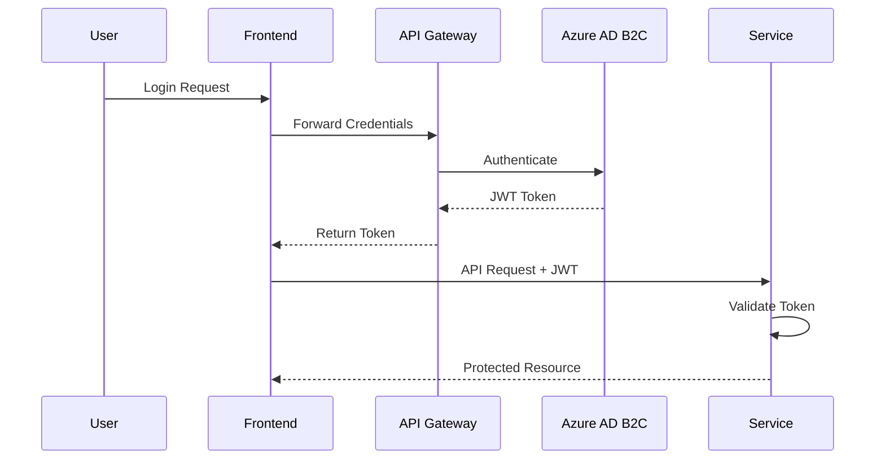

### Authorization Matrix

| Role | User Management | Customer Data | Equipment | Inspector Data | System Config |
|------|----------------|---------------|------------|----------------|---------------|
| Admin | Full Access | Full Access | Full Access | Full Access | Full Access |
| Operations | View Only | Modify | Full Access | Full Access | No Access |
| Inspector | Self Only | No Access | Assigned Only | Self Only | No Access |
| Customer Service | No Access | View Only | View Only | No Access | No Access |

### Authentication Components

| Component | Implementation | Purpose |
|-----------|---------------|----------|
| Identity Provider | Azure AD B2C | Centralized authentication service |
| Token Type | JWT (JSON Web Token) | Secure authentication claims |
| Token Lifetime | 1 hour access / 24 hour refresh | Security with convenience |
| MFA | Azure MFA | Additional security layer |
| Password Policy | 12+ chars, complexity rules | Password security |

## 7.2 DATA SECURITY

### Data Protection Layers

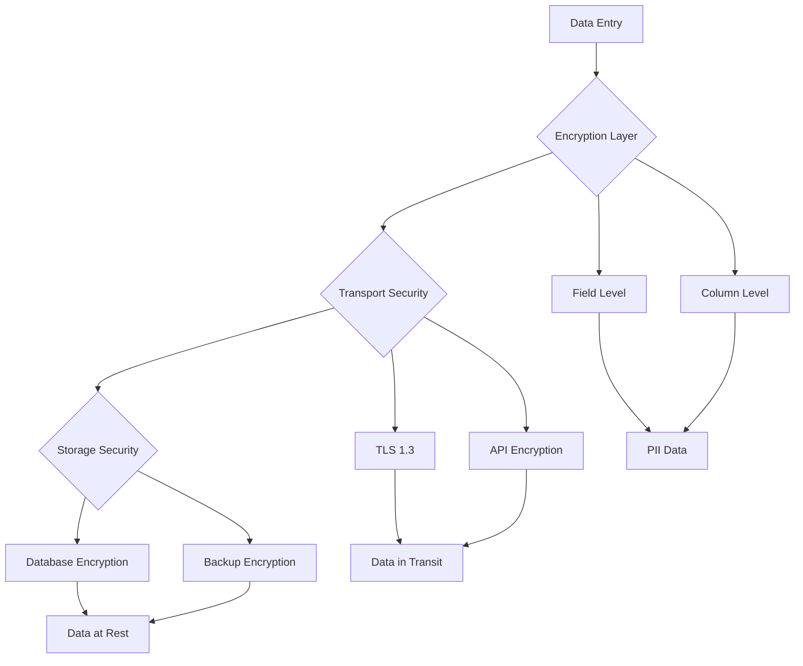

### Encryption Standards

| Data Type | Encryption Method | Key Management |
|-----------|------------------|----------------|
| PII Data | AES-256 Column Encryption | Azure Key Vault |
| Passwords | PBKDF2 with Salt | Secure Hash Storage |
| Documents | AES-256 File Encryption | Customer-specific Keys |
| API Traffic | TLS 1.3 | Managed Certificates |
| Database | Transparent Data Encryption | Azure-managed Keys |

### Data Access Controls

| Data Category | Access Method | Audit Level |
|---------------|--------------|-------------|
| Customer Records | Row-Level Security | Full Audit |
| Financial Data | Column-Level Encryption | Full Audit |
| Personal Info | Field-Level Encryption | Full Audit |
| System Logs | Read-Only Access | Access Logging |
| Documents | Role-Based Access | Version Control |

## 7.3 SECURITY PROTOCOLS

### Security Implementation

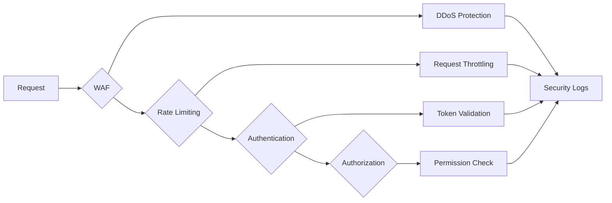

### Security Standards Compliance

| Standard | Implementation | Monitoring |
|----------|---------------|------------|
| OWASP Top 10 | Security Controls | Automated Scans |
| ISO 27001 | Security Framework | Regular Audits |
| GDPR | Data Protection | Compliance Checks |
| SOC 2 | Security Controls | Annual Review |
| PCI DSS | Data Security | Quarterly Scans |

### Security Monitoring

| Component | Monitoring Method | Alert Threshold |
|-----------|------------------|-----------------|
| Failed Logins | Real-time Tracking | 5 attempts/minute |
| API Usage | Rate Monitoring | 1000 requests/minute |
| Data Access | Activity Logging | Unauthorized Attempts |
| System Changes | Change Tracking | All Changes |
| Security Events | SIEM Integration | Severity Based |

### Security Response Protocol

| Event Type | Response Action | Notification Level |
|------------|----------------|-------------------|
| Breach Attempt | Account Lockout | Admin + Security |
| Data Leak | Access Termination | Management + Legal |
| API Abuse | IP Blocking | System Admin |
| Malware Detection | System Isolation | Security Team |
| Policy Violation | Access Suspension | Department Head |

## 8. INFRASTRUCTURE

### 8.1 DEPLOYMENT ENVIRONMENT

```mermaid
flowchart TD
    A[Production Environment] --> B[Azure Cloud]
    A --> C[On-Premises Network]
    
    B --> D[Azure App Services]
    B --> E[Azure SQL]
    B --> F[Azure Cache]
    
    C --> G[Active Directory]
    C --> H[File Shares]
    C --> I[Email Systems]
    
    D --> J[Web Applications]
    D --> K[API Services]
    
    E --> L[Primary Database]
    E --> M[Read Replicas]
    
    F --> N[Redis Cache]
```

| Environment | Purpose | Configuration |
|-------------|---------|---------------|
| Development | Local development | Docker containers, LocalDB |
| Testing | Integration testing | Azure App Service Test slots |
| Staging | Pre-production validation | Production mirror with reduced capacity |
| Production | Live system | High-availability configuration |
| DR | Disaster recovery | Geo-redundant standby |

### 8.2 CLOUD SERVICES

| Service | Purpose | Configuration | Justification |
|---------|---------|---------------|---------------|
| Azure App Service | Application hosting | P2v3 tier, auto-scaling | Native .NET Core support, integrated deployment |
| Azure SQL Database | Data storage | Business Critical tier | High availability, automatic backups |
| Azure Cache for Redis | Session/data caching | Premium P1 | Enhanced performance, data persistence |
| Azure Key Vault | Secret management | Standard tier | Centralized credential management |
| Azure AD B2C | Authentication | P1 tier | Enterprise identity integration |
| Azure CDN | Content delivery | Standard tier | Global content distribution |
| Azure Monitor | System monitoring | Application Insights | Integrated monitoring solution |

### 8.3 CONTAINERIZATION

```mermaid
flowchart LR
    A[Source Code] --> B[Docker Build]
    B --> C{Image Type}
    C -->|Frontend| D[Vue.js Container]
    C -->|Backend| E[ASP.NET Core Container]
    
    D --> F[Azure Container Registry]
    E --> F
    
    F --> G[App Service Deployment]
```

| Component | Base Image | Configuration |
|-----------|------------|---------------|
| Frontend | node:18-alpine | Multi-stage build, Nginx |
| Backend | mcr.microsoft.com/dotnet/aspnet:6.0 | Multi-stage build |
| Database | Not containerized | Azure SQL managed service |
| Cache | Not containerized | Azure Redis managed service |

### 8.4 ORCHESTRATION

| Component | Implementation | Purpose |
|-----------|---------------|----------|
| Service Discovery | Azure DNS | Internal service resolution |
| Load Balancing | Azure Load Balancer | Traffic distribution |
| Scaling | App Service auto-scale | Resource optimization |
| Health Monitoring | Azure Monitor | Service health checks |
| Configuration | App Configuration | Centralized settings |

### 8.5 CI/CD PIPELINE

```mermaid
flowchart TD
    A[Source Code] --> B[Azure DevOps Repo]
    B --> C{Build Pipeline}
    C --> D[Code Analysis]
    C --> E[Unit Tests]
    C --> F[Build Containers]
    
    D --> G{Quality Gate}
    E --> G
    F --> G
    
    G -->|Pass| H[Push to Registry]
    G -->|Fail| I[Notify Team]
    
    H --> J{Deploy Pipeline}
    J --> K[Deploy to Test]
    K --> L[Integration Tests]
    L --> M{Test Results}
    
    M -->|Pass| N[Deploy to Staging]
    M -->|Fail| I
    
    N --> O[Smoke Tests]
    O --> P{Production Release}
    
    P -->|Approved| Q[Deploy to Production]
    P -->|Rejected| R[Rollback]
```

| Stage | Tools | Actions |
|-------|-------|---------|
| Source Control | Azure DevOps | Git branching, PR policies |
| Build | Azure Pipelines | Compile, test, containerize |
| Test | Azure Test Plans | Automated testing, validation |
| Security | SonarQube, OWASP | Code scanning, vulnerability checks |
| Deployment | Azure Pipelines | Blue-green deployment |
| Monitoring | Application Insights | Performance monitoring, alerts |

# 8. APPENDICES

## 8.1 ADDITIONAL TECHNICAL INFORMATION

### Database Partitioning Strategy

```mermaid
flowchart TD
    A[Database] --> B{Partition Type}
    B -->|Customer Data| C[By Region]
    B -->|Equipment Records| D[By Year]
    B -->|Drug Tests| E[By Status]
    B -->|Audit Logs| F[By Quarter]
    
    C --> G[North]
    C --> H[South]
    C --> I[East]
    C --> J[West]
    
    D --> K[Current Year]
    D --> L[Previous Years]
    
    E --> M[Active]
    E --> N[Archived]
    
    F --> O[Rolling Retention]
```

### Geographic Search Implementation

| Component | Implementation | Purpose |
|-----------|---------------|----------|
| SQL Spatial | Geography data type | Store location coordinates |
| Indexing | Spatial indexing | Optimize radius searches |
| Caching | Redis geospatial | Quick proximity lookups |
| Validation | Boundary checking | Ensure valid coordinates |
| Performance | Query optimization | Handle concurrent searches |

## 8.2 GLOSSARY

| Term | Definition |
|------|------------|
| Blue-Green Deployment | Deployment strategy using two identical environments for zero-downtime updates |
| Class Change | Process of modifying an inspector's certification level or role |
| Demobilization | Process of removing an inspector from active assignment |
| Drug Test Kit | Physical equipment used for conducting drug screening tests |
| Equipment Assignment | Process of allocating equipment to specific inspectors |
| Hire Pack | Standard documentation package for new inspector onboarding |
| ISP Transaction | Inspector Service Provider transaction record |
| Mobilization | Process of activating an inspector for project assignment |
| Quick Links | Configurable shortcuts to frequently accessed system functions |
| Row-Level Security | Database security mechanism restricting data access at the row level |
| Ship Opt | Equipment shipping preference setting |
| Virtual Scrolling | Technique for efficient rendering of large data lists |

## 8.3 ACRONYMS

| Acronym | Full Form |
|---------|-----------|
| AD | Active Directory |
| API | Application Programming Interface |
| CRUD | Create, Read, Update, Delete |
| D/A | Drug and Alcohol |
| DOB | Date of Birth |
| GDPR | General Data Protection Regulation |
| JWT | JSON Web Token |
| MFA | Multi-Factor Authentication |
| MTBF | Mean Time Between Failures |
| MTTR | Mean Time To Recovery |
| PII | Personally Identifiable Information |
| REST | Representational State Transfer |
| RPO | Recovery Point Objective |
| RTO | Recovery Time Objective |
| SIEM | Security Information and Event Management |
| SQL | Structured Query Language |
| SRS | Software Requirements Specification |
| TLS | Transport Layer Security |
| UI/UX | User Interface/User Experience |
| WCAG | Web Content Accessibility Guidelines |

## 8.4 REFERENCE ARCHITECTURE

```mermaid
flowchart TD
    A[Client Browser] --> B{Load Balancer}
    B --> C[Web Application]
    C --> D[API Gateway]
    
    D --> E[Authentication]
    D --> F[Business Services]
    D --> G[Integration Services]
    
    E --> H[(Azure AD)]
    F --> I[(SQL Server)]
    G --> J[OneDrive]
    G --> K[Email Service]
    
    I --> L[Primary]
    I --> M[Replica]
    
    style A fill:#f9f,stroke:#333,stroke-width:2px
    style B fill:#bbf,stroke:#333,stroke-width:2px
    style C fill:#dfd,stroke:#333,stroke-width:2px
```